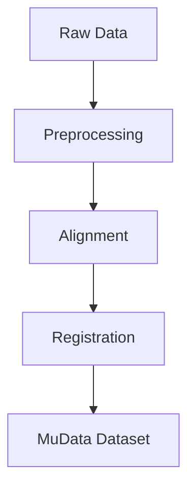

# FOCUS Documentation

Welcome to the comprehensive documentation for FOCUS — Flexible Omics Curation and Unified Standardization.

## Overview

FOCUS is an end-to-end preprocessing, alignment, and registration pipeline for **spatial multiomics** datasets. It integrates data acquired from different imaging and omics modalities on the same tissue section into a single, analysis-ready multimodal dataset.

**Key Features:**
- ✅ No programming required — JSON configuration driven
- ✅ Interactive web-based GUI for configuration and alignment
- ✅ Supports microscopy, MSI/lipidomics, Raman spectroscopy, and spatial transcriptomics
- ✅ Outputs MuData (`.h5mu`) compatible with scanpy, squidpy, and AnnData
- ✅ Cross-platform: Windows, macOS, Linux, and HPC environments
- ✅ Containerized deployment with Docker, Podman, Singularity/Apptainer

## Documentation Structure

```
docs/
├── index.md                  # This file
├── overview.md               # System overview and architecture
├── installation.md           # Installation instructions
├── quick_start/
│   ├── gui_usage.md         # GUI usage guide
│   └── cli_usage.md          # CLI usage guide
├── configuration/
│   ├── config_structure.md   # Configuration file structure
│   └── config_fields.md      # Detailed field explanations
├── pipeline/
│   ├── preprocessing.md      # Preprocessing stage details
│   ├── alignment.md          # Alignment stage details
│   ├── registration.md       # Registration stage details
│   └── compilation.md        # MuData compilation details
├── modalities/
│   ├── microscopy.md         # Microscopy image processing
│   ├── msi.md                # MSI/Lipidomics processing
│   ├── raman.md              # Raman spectroscopy processing
│   └── transcriptomics.md    # Spatial transcriptomics processing
├── deployment/
│   ├── host_install.md       # Host machine installation
│   ├── containers.md         # Container deployment
│   └── hpc.md                # HPC/headless server deployment
└── api/
    └── gui_api.md            # GUI API specification
```

## Getting Started

- **New users**: Start with the [Quick Start Guide](quick_start/gui_usage.md) to learn how to use the interactive GUI
- **Advanced users**: Check the [CLI Usage](quick_start/cli_usage.md) for automated pipeline execution
- **Developers**: Explore the [Configuration Reference](configuration/config_fields.md) for detailed configuration options
- **System administrators**: See [Deployment Options](deployment/) for installation and container setup

## Supported Modalities

| Modality | Type Key | Input Format | Output Format |
|----------|----------|--------------|---------------|
| Fluorescence/brightfield microscopy | `microscopy_image` | `.tiff`, `.tif`, `.czi` | OME-TIFF pyramid |
| Mass Spectrometry Imaging (MSI/lipidomics) | `msi` | `.imzML` + `.ibd` | AnnData `.h5ad` |
| Raman spectroscopy | `raman` | `.lif` | OME-TIFF (hyperspectral) |
| Spatial transcriptomics | `st` | AnnData `.h5ad` | AnnData `.h5ad` |

## Pipeline Overview



1. **Preprocessing**: Modality-specific quality control, normalization, background removal
2. **Alignment**: Interactive web GUI for manual landmark registration
3. **Registration**: Feature-based mapping or interpolation between modalities
4. **Compilation**: Merge all modalities into final MuData (`.h5mu`) file

## Need Help?

- Check the [Troubleshooting Guide](troubleshooting.md) for common issues
- Review the [FAQ](faq.md) for frequently asked questions
- Explore the [API Reference](api/) for technical details