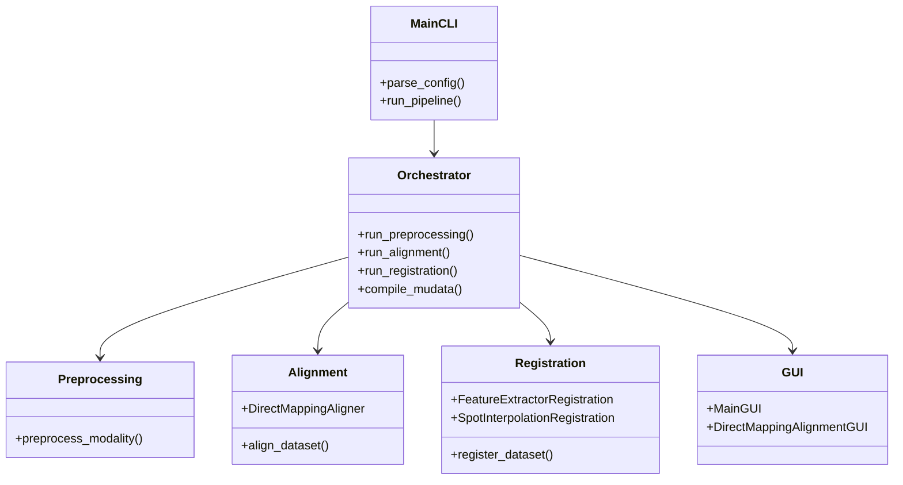
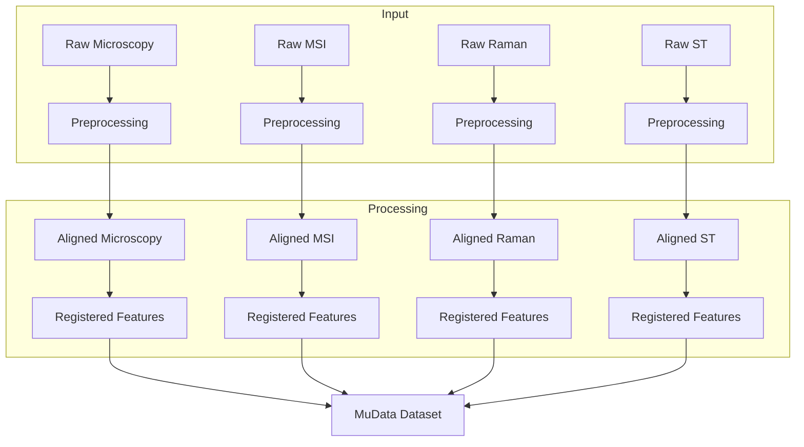

# FOCUS Overview

## System Architecture

FOCUS implements a three-stage pipeline for spatial multiomics data integration:

```
Raw Data → Preprocessing → Alignment → Registration → Multimodal Dataset
```

### High-Level Components



### Directory Structure

FOCUS expects and produces this standardized directory layout:

```
<dataset_path>/
├── <sample_id_1>/
│   ├── <modality_name>/				# Raw input files
│   ├── preprocessing/<modality>/		# Preprocessed output
│   ├── alignment/					# Aligned files
│   └── registration/				# Registered files
├── <sample_id_2>/
│   └── ...
└── merged/
    ├── preprocessing/				# Combined preprocessing
    ├── alignment/					# Combined alignment
    ├── registration/				# Combined registration
    └── multimodal_dataset.h5mu		# Final output
```

## Dataset Structure Requirements

### Input Directory Organization

FOCUS requires a specific directory structure for input data:

```
<dataset_path>/
├── sample_001/
│   ├── microscopy/				# Must match config modality name
│   │   └── image.tiff			# Single TIFF/CZI file per sample
│   ├── msi/					# Must match config modality name
│   │   ├── pos/				# Positive ion mode (required)
│   │   │   ├── data.imzML		# imzML metadata
│   │   │   └── data.ibd		# Binary data
│   │   └── neg/				# Negative ion mode (optional)
│   │       ├── data.imzML		# imzML metadata
│   │       └── data.ibd		# Binary data
│   ├── raman/				# Must match config modality name
│   │   └── scan.lif			# Single LIF file per sample
│   ├── st/					# Must match config modality name
│   │   └── expression.h5ad		# Single AnnData file per sample
│   └── microscopy/			# Spatial annotations (if enabled)				
│       └── annotations.geojson	# GeoJSON annotations
├── sample_002/
│   ├── microscopy/				# Must have same modalities as sample_001
│   ├── msi/					# Must have same modalities as sample_001
│   ├── raman/					# Must have same modalities as sample_001
│   ├── st/					# Must have same modalities as sample_001
│   └── microscopy/			# Spatial annotations (if enabled)				
│       └── annotations.geojson	# GeoJSON annotations
└── ...
```

**Critical Requirements:**

1. **Consistent Modalities**: Once a modality is defined in the configuration, it must be present for **every sample** with the exact same directory name.

2. **File Requirements by Modality**:
   - **Microscopy**: Exactly **one** TIFF or CZI file per sample
   - **Raman**: Exactly **one** LIF file per sample
   - **MSI**: 
     - **Positive ion mode**: 2 files (`data.imzML` + `data.ibd`) in `pos/` subfolder
     - **Negative ion mode**: 2 files (`data.imzML` + `data.ibd`) in `neg/` subfolder
     - **Both modes**: 4 files total (2 in `pos/`, 2 in `neg/`)
   - **Spatial Transcriptomics**: Exactly **one** AnnData (`.h5ad`) file per sample

3. **Spatial Annotations** (if enabled):
   - Exactly **one** GeoJSON file per sample
   - Must be placed in the modality directory it refers to
   - **All samples must have annotation files** if spatial annotations are enabled in config
   - File naming: `<sample_id>.geojson` recommended

4. **Naming Constraints**:
   - Modality directory names must **exactly match** (case-sensitive) the `"name"` field in configuration
   - Sample directory names become sample identifiers in the output
   - File extensions determine processing (`.tiff`, `.imzML`, etc.)

## Core Concepts

### Modalities

FOCUS supports four types of spatial omics modalities:

1. **Microscopy Images**: Fluorescence/brightfield microscopy data
2. **MSI/Lipidomics**: Mass spectrometry imaging data
3. **Raman Spectroscopy**: Hyperspectral Raman imaging data  
4. **Spatial Transcriptomics**: Gene expression data with spatial coordinates

### Pipeline Stages

#### 1. Preprocessing
- **Purpose**: Modality-specific quality control and standardization
- **Operations**: Normalization, background removal, format conversion
- **Output**: Standardized files (OME-TIFF for images, AnnData for omics)

#### 2. Alignment
- **Purpose**: Manual registration between modalities
- **Method**: Interactive web GUI for landmark-based alignment
- **Output**: Aligned coordinate systems across modalities

#### 3. Registration
- **Purpose**: Feature-based mapping between modalities
- **Methods**:
  - **Feature Extraction**: Deep learning patch embeddings (GPU required)
  - **Spot Interpolation**: Gaussian-weighted feature interpolation
- **Output**: Registered feature matrices in common coordinate space

#### 4. Compilation
- **Purpose**: Merge all modalities into analysis-ready format
- **Output**: MuData (`.h5mu`) file compatible with scanpy/squidpy

### Configuration

The entire pipeline is driven by a JSON configuration file with sections for:
- Dataset paths and sample organization
- Modality definitions and processing parameters
- Alignment and registration strategies
- Output options and quality control settings

### Data Flow



## Technical Specifications

### Supported File Formats

| Stage | Modality | Input Formats | Output Formats |
|-------|----------|---------------|----------------|
| Preprocessing | Microscopy | `.tiff`, `.tif`, `.czi` | OME-TIFF pyramid |
| Preprocessing | MSI | `.imzML` + `.ibd` | AnnData `.h5ad` |
| Preprocessing | Raman | `.lif` | OME-TIFF hyperspectral |
| Preprocessing | ST | AnnData `.h5ad` | AnnData `.h5ad` |
| Alignment | All | Preprocessed files | Aligned coordinates |
| Registration | All | Aligned files | Registered AnnData |
| Compilation | All | Registered files | MuData `.h5mu` |

### System Requirements

| Component | Requirement | Notes |
|-----------|-------------|-------|
| **Python** | 3.11 | Managed by conda environment |
| **Conda** | Miniconda/Anaconda | Required for environment management |
| **GPU** | NVIDIA + CUDA | Optional, required for feature extraction registration |
| **RAM** | 16GB+ recommended | Depends on dataset size |
| **Storage** | SSD recommended | Large intermediate files |

### Platform Compatibility

| Feature | Windows | macOS | Linux Desktop | Linux HPC |
|---------|---------|-------|--------------|----------|
| Host install | ✅ | ✅ | ✅ | ✅ |
| GUI mode | ✅ | ✅ | ✅ | SSH tunnel |
| CLI mode | ✅ | ✅ | ✅ | ✅ |
| Docker/Podman | ✅ | ✅ | ✅ | ✅ |
| Singularity/Apptainer | WSL2 | ✅ | ✅ | ✅ |
| GPU acceleration | ✅ | ❌ | ✅ | ✅ |

## Architecture Details

### Modular Design

FOCUS follows a modular architecture with clear separation of concerns:

- **Preprocessing Module**: Handles modality-specific data cleaning
- **Alignment Module**: Manages coordinate system registration
- **Registration Module**: Performs feature mapping between modalities
- **GUI Module**: Provides interactive configuration and alignment interfaces
- **Orchestrator**: Coordinates the pipeline execution

### Key Classes

- `MicroscopyImage`, `MsiSample`, `RamanImage`, `SpatialTranscriptomic`: Modality processors
- `DirectMappingAligner`: Interactive alignment handler
- `FeatureExtractorRegistration`, `SpotInterpolationRegistration`: Registration engines
- `MainGUI`, `DirectMappingAlignmentGUI`: User interface components

### Configuration System

The JSON configuration system provides:
- **Validation**: Schema validation for required fields
- **Flexibility**: Per-modality parameter tuning
- **Reusability**: Save and load configurations for reproducible workflows
- **Versioning**: Configuration files are versioned with the dataset

## Performance Considerations

### Processing Time

- **Preprocessing**: Minutes to hours per modality (I/O bound)
- **Alignment**: Interactive, user-dependent time
- **Registration**: Minutes to hours (CPU/GPU bound)
- **Compilation**: Minutes (I/O bound)

### Optimization Strategies

1. **Caching**: Intermediate results are cached to avoid recomputation
2. **Parallelization**: Multi-core processing for independent samples
3. **GPU Acceleration**: Optional for feature extraction registration
4. **Memory Management**: Streaming for large datasets

### Scalability

- **Sample-level parallelism**: Process multiple samples concurrently
- **Modality independence**: Modalities can be processed in any order
- **Incremental processing**: Resume from any stage

## Security and Data Handling

### Data Privacy

- All processing occurs locally on your machine
- No data is transmitted to external servers
- Configuration files contain only metadata, not raw data

### Authentication

- HuggingFace token required only for feature extraction registration
- Token is used solely for model download (cached locally)
- No persistent authentication storage

### Container Security

- Containers run with minimal privileges
- Data mounted read-only where possible
- No network access required for core functionality

## Roadmap and Future Development

### Planned Features

- Additional modality support (e.g., proteomics, metabolomics)
- Enhanced GUI with more visualization options
- Automated quality control metrics
- Cloud deployment options
- Expanded API for programmatic integration

### Community Contributions

FOCUS welcomes contributions in areas such as:
- New modality processors
- Performance optimizations
- Documentation improvements
- Bug fixes and testing
- GUI enhancements

## Getting Help

- **Documentation**: Comprehensive guides and API reference
- **Examples**: Sample configurations and datasets
- **Community**: GitHub issues and discussions
- **Support**: Contact maintainers for assistance

## License

FOCUS is released under the [MIT License](https://opensource.org/licenses/MIT), allowing free use, modification, and distribution for both academic and commercial purposes.