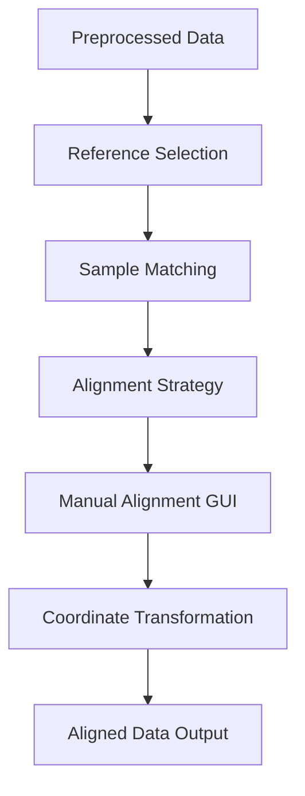

# Alignment Stage

## Overview

The alignment stage in FOCUS performs spatial registration between different modalities, ensuring that features from each modality can be accurately mapped to a common coordinate system. This stage is crucial for multi-modal integration and typically requires manual intervention through an interactive GUI.

## Alignment Workflow



## Key Concepts

### Reference vs Target Modalities

- **Reference Modality**: The coordinate system that other modalities will be aligned to
- **Target Modalities**: Modalities that will be transformed to match the reference
- The reference modality is specified in the configuration file (`reference_modality`)

### Alignment Strategies

FOCUS supports three alignment strategies:

1. **Manual Alignment** (default): Interactive GUI for precise landmark-based registration
2. **Pre-aligned**: Assume modalities are already registered (no transformation applied)
3. **Uniform**: Apply uniform scaling without GUI interaction

### Coordinate Systems

- **Physical Coordinates**: Real-world units (typically micrometers)
- **Pixel Coordinates**: Image raster coordinates
- **Spot Coordinates**: Discrete measurement locations (for MSI, ST)

## Manual Alignment Process

### Starting the Alignment Tool

The manual alignment tool is launched automatically during pipeline execution when:

1. `perform_alignment: true` in configuration
2. `alignment_strategy: "manual"` for the modality
3. Alignment is needed (not already cached)

**User Interface**:
- Web-based interface at `http://localhost:8000`
- Separate from main GUI (port 5050)
- Launches automatically when needed

### Alignment Tool Interface

```
+---------------------------------------------------+
| Reference Modality | Target Modality             |
| +-----------------+ | +-----------------+        |
| |   Image/Spots   | | |   Image/Spots   |        |
| |                 | | |                 |        |
| |    (Fixed)      | | |    (Moving)     |        |
| +-----------------+ | +-----------------+        |
|                                                   |
| Controls:                                         |
| [Mode] [Zoom] [Pan] [Reset] [Confirm]             |
|                                                   |
| Sample: sample_001 (1/5)                          |
+---------------------------------------------------+
```

### Alignment Modes

FOCUS supports different alignment modes based on modality types:

#### 1. Image-to-Image Alignment

**Use Case**: Aligning two microscopy images or Raman hyperspectral images

**Process**:
1. Reference image displayed on left (fixed)
2. Target image displayed on right (movable)
3. User drags corners of target image to match reference
4. System computes affine transformation
5. Target image is warped to match reference

**Controls**:
- Drag corner handles to transform target
- Zoom/pan for precise alignment
- Reset to original position

**Output**: Affine transformation matrix

#### 2. Image-to-Spot Alignment

**Use Case**: Aligning MSI or ST spots to a microscopy reference image

**Process**:
1. Reference image displayed on left (fixed)
2. Target spots displayed as colored points on right
3. User drags individual spots or groups to correct positions
4. System records new coordinates for each spot
5. Spot size adjusted to match image scale

**Controls**:
- Drag individual spots
- Select multiple spots for group movement
- Adjust spot size slider
- Toggle spot classes

**Output**: New coordinate list for each spot

#### 3. Spot-to-Spot Alignment

**Use Case**: Aligning two spot-based modalities (e.g., MSI to ST)

**Process**:
1. Reference spots displayed on left (fixed)
2. Target spots displayed on right (movable)
3. User matches corresponding spots between modalities
4. System computes transformation
5. Target spots are transformed to reference space

**Controls**:
- Drag target spots to match reference
- Use distance metrics for guidance
- Toggle spot visibility

**Output**: Transformation matrix mapping target to reference

### Navigation and Controls

**Zoom Controls**:
- Mouse wheel: Zoom in/out
- +/- buttons: Step zoom
- Double-click: Reset zoom
- Slider: Continuous zoom

**Pan Controls**:
- Click + drag background: Pan view
- Arrow keys: Fine pan adjustment
- Home button: Reset view

**Overlay Controls**:
- Opacity slider: Adjust overlay transparency
- Toggle buttons: Show/hide reference or target
- Grid overlay: Toggle alignment grid

**Measurement Tools**:
- Distance tool: Measure between points
- Angle tool: Measure angles
- Scale bar: Display spatial scale

### Alignment Workflow

1. **Sample Loading**: Tool automatically loads current sample
2. **Initial Display**: Reference and target data displayed
3. **Rough Alignment**: User performs initial approximate alignment
4. **Fine Tuning**: Zoom in for precise landmark matching
5. **Validation**: User verifies alignment quality
6. **Confirmation**: Click "Confirm Alignment" to save
7. **Next Sample**: Tool automatically advances
8. **Completion**: Close tool when all samples processed

### Best Practices for Accurate Alignment

1. **Landmark Selection**:
   - Use 6+ well-distributed landmarks
   - Choose distinctive, unambiguous features
   - Avoid symmetric features
   - Include edge landmarks

2. **Precision Techniques**:
   - Use maximum zoom for critical areas
   - Enable grid overlay for guidance
   - Check multiple landmarks for consistency
   - Verify with distance measurements

3. **Quality Control**:
   - Check entire tissue area coverage
   - Verify no folding or stretching artifacts
   - Confirm landmark correspondence
   - Review alignment in multiple regions

4. **Efficiency Tips**:
   - Start with obvious landmarks
   - Work from coarse to fine
   - Use reference images for guidance
   - Save progress frequently

## Alignment Data Flow

### Input Requirements

For alignment to work, FOCUS requires:

1. **Preprocessed Data**: Successful preprocessing stage completion
2. **Common Samples**: Samples must exist in both modalities
3. **Valid Coordinates**: Spatial information must be present
4. **Compatible Types**: Supported modality combinations

### Supported Modality Combinations

| Reference Type | Target Type | Supported | Notes |
|----------------|-------------|-----------|-------|
| IMAGE | IMAGE | ✅ | Full affine transformation |
| IMAGE | SPOT | ✅ | Spot coordinate mapping |
| SPOT | IMAGE | ❌ | Not implemented |
| SPOT | SPOT | ✅ | Coordinate transformation |

**Type Definitions**:
- **IMAGE**: Microscopy, Raman (hyperspectral images)
- **SPOT**: MSI, Spatial Transcriptomics (discrete measurements)

### Output Files

```
<dataset_path>/<sample_id>/alignment/
├── microscopy_to_msi/		# Reference → Target
│   ├── sample_001_aligned.h5ad	# Aligned coordinates
│   └── transformation.json	# Transformation matrix
├── microscopy_to_raman/		# If multiple targets
│   └── ...
└── ...
```

### Output Structure

**For Spot-based Targets (MSI, ST)**:
- Aligned AnnData object
- New coordinates in `obsm['{target}_spatial']`
- Original coordinates preserved in `obsm['spatial']`
- Transformation metadata in `uns`

**For Image-based Targets**:
- Warped OME-TIFF image
- Transformation matrix
- Bounding box information

### Merged Alignment Files

After all samples processed, FOCUS creates merged alignment files:

```
<dataset_path>/merged/alignment/
├── microscopy_to_msi/
│   ├── merged_aligned.h5ad		# Combined coordinates
│   └── transformation.json		# Average transformation
└── ...
```

## Technical Implementation

### Transformation Mathematics

FOCUS uses affine transformations for alignment:

```
| x' |   | a  b  c | | x |
| y' | = | d  e  f | | y |
| 1  |   | 0  0  1 | | 1 |
```

**Parameters**:
- `a,e`: Scaling factors
- `b,d`: Shear factors
- `c,f`: Translation factors

**For Image-to-Image**: Full 6-parameter affine transformation
**For Image-to-Spot**: Rigid transformation (rotation + translation + scaling)
**For Spot-to-Spot**: Similarity transformation

### Coordinate Systems

**Physical Coordinates**:
- Units: Micrometers (µm)
- Origin: Typically top-left of tissue
- Orientation: X = right, Y = down

**Pixel Coordinates**:
- Units: Pixels
- Origin: (0,0) at top-left of image
- Orientation: X = right, Y = down

**Conversions**:
- Pixel → Physical: `physical = pixel * pixel_size`
- Physical → Pixel: `pixel = physical / pixel_size`

### Data Structures

**AlignmentResult Class**:
```python
class AlignmentResult:
    def __init__(self):
        self.sample_id = ""
        self.reference_modality = ""
        self.target_modality = ""
        self.transformation_matrix = np.eye(3)
        self.aligned_coordinates = None
        self.quality_metrics = {}
        self.timestamp = ""
```

**Quality Metrics**:
- RMS error between landmarks
- Number of landmarks used
- Transformation parameters
- Processing time

## Performance Considerations

### Processing Time

- **Manual Alignment**: User-dependent (minutes per sample)
- **Pre-aligned**: Instant (no processing)
- **Uniform**: < 1 second per sample

### Memory Usage

- **Image Data**: Depends on image size and resolution
- **Spot Data**: Minimal (coordinates only)
- **GUI**: ~500MB for typical images

### Optimization Strategies

1. **Resolution Management**:
   - Use appropriate pyramid level
   - Balance detail vs performance
   - Level 1-2 often sufficient

2. **Sample Batching**:
   - Process similar samples together
   - Reuse transformation parameters
   - Apply batch transformations

3. **GPU Acceleration**:
   - Image warping on GPU
   - Real-time preview
   - Requires WebGL support

## Error Handling and Recovery

### Common Alignment Errors

| Error | Cause | Solution |
|-------|-------|----------|
| "No common samples" | Samples missing in one modality | Check directory structure |
| "Coordinate mismatch" | Invalid coordinate systems | Verify preprocessing output |
| "GUI failed to start" | Port conflict | Kill process on port 8000 |
| "Transformation failed" | Invalid landmarks | Check landmark placement |
| "Memory error" | Large images | Use lower resolution level |

### Recovery Strategies

1. **Resume Alignment**:
   - FOCUS tracks completed samples
   - Resume from last successful sample
   - Manual restart continues progress

2. **Revert Alignment**:
   - Delete alignment files
   - Set `force_recomputing: true`
   - Rerun alignment stage

3. **Manual Correction**:
   - Edit transformation matrices
   - Adjust coordinates manually
   - Re-save alignment files

## Configuration Options

### Alignment Configuration Fields

```json
{
  "name": "msi",
  "type": "msi",
  "alignment_strategy": "manual",
  "processing_settings": {}
}
```

**Strategy Options**:
- `"manual"`: Interactive GUI (default)
- `"pre_aligned"`: Skip alignment
- `"uniform"`: Uniform scaling

### Global Alignment Settings

```json
{
  "alignment_force_recomputing": true,
  "alignment_resolution_level": 1,
  "alignment_gui_port": 8000
}
```

**Fields**:
- `alignment_force_recomputing`: Force re-run alignment
- `alignment_resolution_level`: Pyramid level for alignment
- `alignment_gui_port`: Port for alignment tool

## Advanced Alignment Techniques

### Multi-Sample Alignment

For consistent alignment across samples:

1. **Reference Sample Selection**: Choose best sample as reference
2. **Individual Alignment**: Align each sample to reference
3. **Consistency Check**: Verify transformations are similar
4. **Batch Apply**: Apply average transformation

### Automated Alignment (Experimental)

FOCUS supports experimental automated alignment:

```json
{
  "alignment_strategy": "automatic",
  "alignment_settings": {
    "feature_type": "sift",
    "matcher": "flann",
    "min_matches": 10
  }
}
```

**Limitations**:
- Less accurate than manual
- Requires distinctive features
- May fail on uniform tissues

### Deformation Fields

For non-rigid alignment (experimental):

```json
{
  "alignment_strategy": "deformable",
  "alignment_settings": {
    "grid_size": 10,
    "regularization": 0.1
  }
}
```

**Use Cases**:
- Tissue deformation correction
- Non-linear warping
- Complex transformations

## Validation and Quality Control

### Alignment Quality Metrics

FOCUS computes several quality metrics:

1. **RMS Error**: Root mean square error between landmarks
2. **Landmark Coverage**: Distribution of landmarks
3. **Transformation Magnitude**: Scale of transformation
4. **Consistency Score**: Across multiple samples

### Visual Validation

**Overlap Visualization**:
- Reference and target overlaid
- Adjustable opacity
- Color-coded by modality

**Difference Maps**:
- Highlight misaligned regions
- Color by displacement magnitude
- Threshold for significant errors

**Landmark Review**:
- Display all landmarks
- Show residual errors
- Identify outliers

### Quantitative Validation

**Metrics Calculated**:
- Mean landmark distance
- Standard deviation of errors
- Maximum residual error
- Transformation parameters

**Acceptance Criteria**:
- RMS error < 5 pixels (typical)
- Even landmark distribution
- No obvious artifacts
- Consistent across samples

## Troubleshooting Alignment Issues

### Common Problems and Solutions

**Problem**: GUI doesn't start
- **Check**: Port 8000 availability
- **Solution**: `lsof -i :8000` then `kill <PID>`
- **Alternative**: Change port in config

**Problem**: Images not loading
- **Check**: Preprocessing completed successfully
- **Solution**: Verify preprocessing output files
- **Alternative**: Rerun preprocessing

**Problem**: Poor alignment quality
- **Check**: Landmark selection
- **Solution**: Use more/distributed landmarks
- **Alternative**: Try different reference modality

**Problem**: Slow performance
- **Check**: Image resolution level
- **Solution**: Increase `resolution_level` (try 1 or 2)
- **Alternative**: Use smaller image region

**Problem**: Transformation fails
- **Check**: Landmark correspondence
- **Solution**: Remove outlier landmarks
- **Alternative**: Reset and start over

### Debugging Techniques

**Enable Debug Logging**:
```json
{
  "logging_level": "DEBUG"
}
```

**Check Transformation Matrices**:
```python
import json
with open('transformation.json') as f:
    matrix = json.load(f)
print(f"Transformation: {matrix}")
```

**Visualize Alignment**:
```python
from focus.visualization import plot_alignment
plot_alignment(
    reference_path="ref.ome.tiff",
    target_path="tgt.ome.tiff",
    transformation="transformation.json"
)
```

## Best Practices

### Workflow Optimization

1. **Reference Selection**:
   - Choose modality with clear landmarks
   - Highest resolution available
   - Most complete tissue coverage

2. **Sample Preparation**:
   - Ensure consistent sample orientation
   - Use fiducial markers if possible
   - Document sample handling

3. **Landmark Strategy**:
   - Use anatomical features
   - Include edge landmarks
   - 6-10 landmarks per sample
   - Document landmark locations

### Quality Assurance

1. **Double-Check Alignment**:
   - Review each sample
   - Verify multiple regions
   - Check edge cases
   - Document issues

2. **Consistency Verification**:
   - Compare across samples
   - Check transformation parameters
   - Validate biological plausibility
   - Review quality metrics

3. **Documentation**:
   - Record alignment parameters
   - Note any difficulties
   - Document landmark strategy
   - Store transformation matrices

### Performance Tips

1. **Efficient Workflow**:
   - Process similar samples together
   - Use consistent landmark patterns
   - Save progress frequently
   - Take breaks to avoid fatigue

2. **Resource Management**:
   - Close other applications
   - Use appropriate resolution
   - Monitor memory usage
   - Clear browser cache

3. **Batch Processing**:
   - Align all samples before proceeding
   - Verify consistency
   - Apply corrections uniformly
   - Document batch parameters

## Next Steps

After successful alignment:

1. **Review Alignment**: Check quality metrics and visualizations
2. **Proceed to Registration**: Continue to [Registration Stage](registration.md)
3. **Document Results**: Record alignment parameters and quality
4. **Backup Data**: Save alignment files and transformations

## Additional Resources

- [Registration Documentation](registration.md) - Next pipeline stage
- [Configuration Reference](../configuration/config_fields.md) - Alignment parameters
- [Preprocessing Documentation](preprocessing.md) - Previous stage
- [Troubleshooting Guide](../troubleshooting.md) - Common issues