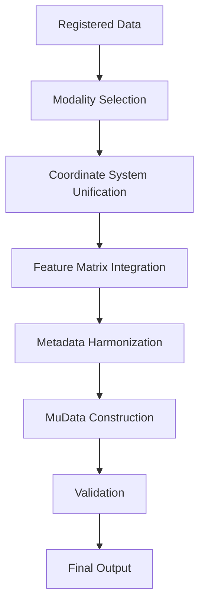

# MuData Compilation Stage

## Overview

The compilation stage is the final step in the FOCUS pipeline, where all processed, aligned, and registered modalities are merged into a single MuData object. This creates an analysis-ready, multi-modal dataset that can be used with standard single-cell and spatial omics tools like scanpy and squidpy.

## Compilation Workflow



## Key Concepts

### MuData Structure

MuData is a multi-modal extension of AnnData that organizes multiple data modalities:

```
MuData Object
├── mod['modality1']: AnnData (modality 1 features)
├── mod['modality2']: AnnData (modality 2 features)
├── obs: Observations (shared across modalities)
├── obsm: Observation metadata
└── uns: Global metadata
```

### Compilation Requirements

For successful compilation, FOCUS requires:

1. **Spot-Based Reference**: Reference modality must be spot-based (MSI or ST)
2. **Completed Registration**: All target modalities must be registered
3. **Consistent Observations**: Same number of spots across modalities
4. **Valid Coordinates**: Unified spatial coordinate system

### Supported Output Formats

- **Primary**: MuData (`.h5mu`)
- **Legacy**: Individual AnnData files (`.h5ad`)
- **Export**: CSV, loom, and other formats

## Compilation Process

### Step 1: Input Validation

FOCUS validates all inputs before compilation:

1. **File Existence**: Check all registered files exist
2. **Format Validation**: Verify AnnData structure
3. **Dimension Matching**: Ensure consistent spot counts
4. **Coordinate Validation**: Check spatial consistency

**Validation Checks**:
```python
# Example validation code
def validate_compilation_inputs(config, registered_files):
    ref_mod = get_reference_modality(config)
    
    # Check reference modality is spot-based
    if ref_mod['type'] not in ['msi', 'st']:
        raise ValueError("Reference must be spot-based for compilation")
    
    # Check all registered files exist
    for mod_name, files in registered_files.items():
        for sample_id, file_path in files.items():
            if not os.path.exists(file_path):
                raise FileNotFoundError(f"Missing registered file: {file_path}")
    
    # Check spot counts match
    ref_adata = anndata.read_h5ad(registered_files[ref_mod['name']]['merged'])
    n_spots = ref_adata.n_obs
    
    for mod_name, files in registered_files.items():
        if mod_name == ref_mod['name']:
            continue
        
        reg_adata = anndata.read_h5ad(files['merged'])
        if reg_adata.n_obs != n_spots:
            raise ValueError(f"Spot count mismatch: {mod_name}")
```

### Step 2: Reference Modality Loading

The reference modality serves as the foundation:

1. **Load Merged Data**: Read reference AnnData
2. **Extract Shared Metadata**: Copy observations and coordinates
3. **Prepare Spatial Data**: Extract spatial coordinates
4. **Handle Annotations**: Include spatial annotations if present

**Reference Loading**:
```python
# Load reference modality
ref_merged_path = registered_files[ref_name]['merged']
ref_adata = anndata.read_h5ad(ref_merged_path)

# Extract shared data
shared_obs = ref_adata.obs.copy()
shared_obsm = {}
if 'spatial' in ref_adata.obsm:
    shared_obsm['spatial'] = ref_adata.obsm['spatial'].copy()

# Extract sample IDs
sample_ids = ref_adata.obs['sample_id'].values

# Handle spatial annotations
spatial_annotations = None
if 'spatial_annotation' in ref_adata.obs:
    spatial_annotations = ref_adata.obs['spatial_annotation'].values
```

### Step 3: Modality Integration

Each registered modality is integrated into the MuData structure:

1. **Load Registered Data**: Read each modality's registered features
2. **Validate Dimensions**: Ensure spot counts match
3. **Clean Metadata**: Remove modality-specific coordinates
4. **Preserve Features**: Keep modality-specific feature information

**Modality Integration**:
```python
mod_dict = {}

# Add reference modality (cleaned)
ref_clean = ref_adata.copy()
if 'spatial' in ref_clean.obsm:
    del ref_clean.obsm['spatial']
if 'spot_size' in ref_clean.uns:
    del ref_clean.uns['spot_size']
mod_dict[ref_name] = ref_clean

# Add registered modalities
for modality in modalities:
    mod_name = modality['name']
    if mod_name == ref_name:
        continue
    
    if mod_name not in registered_files:
        logger.warning(f"No registration output for {mod_name}, skipping")
        continue
    
    merged_path = registered_files[mod_name]['merged']
    if not os.path.exists(merged_path):
        logger.warning(f"Missing merged file for {mod_name}")
        continue
    
    reg_adata = anndata.read_h5ad(merged_path)
    
    # Validate dimensions
    if reg_adata.n_obs != ref_adata.n_obs:
        logger.warning(f"Observation count mismatch for {mod_name}")
        continue
    
    # Clean metadata
    reg_clean = reg_adata.copy()
    if 'spatial' in reg_clean.obsm:
        del reg_clean.obsm['spatial']
    if 'spot_size' in reg_clean.uns:
        del reg_clean.uns['spot_size']
    
    # Ensure consistent observation names
    reg_clean.obs_names = ref_adata.obs_names.tolist()
    
    mod_dict[mod_name] = reg_clean
```

### Step 4: MuData Construction

The final MuData object is assembled:

1. **Create MuData**: Initialize with modality dictionary
2. **Add Shared Data**: Copy observations and spatial coordinates
3. **Preserve Spot Size**: Include spot size information
4. **Handle Annotations**: Add spatial annotations to top level

**MuData Assembly**:
```python
# Create MuData object
mdata = mudata.MuData(mod_dict)

# Add shared observations
mdata.obs = shared_obs

# Add spatial coordinates
if 'spatial' in shared_obsm:
    mdata.obsm['spatial'] = shared_obsm['spatial']

# Add spot size if available
if 'spot_size' in ref_adata.uns:
    mdata.uns['spot_size'] = ref_adata.uns['spot_size']

# Add spatial annotations
if spatial_annotations is not None:
    mdata.obs['spatial_annotation'] = spatial_annotations
    logger.info("Spatial annotation labels promoted to mdata.obs['spatial_annotation']")
```

### Step 5: Validation and Quality Control

FOCUS performs comprehensive validation:

1. **Structural Validation**: Verify MuData integrity
2. **Data Consistency**: Check cross-modality alignment
3. **Metadata Completeness**: Ensure all required fields present
4. **Spatial Validation**: Confirm coordinate systems

**Validation Checks**:
```python
def validate_mudata(mdata, config):
    # Check basic structure
    if len(mdata.mod) < 2:
        raise ValueError("MuData must contain at least 2 modalities")
    
    # Check observation consistency
    n_obs = mdata.n_obs
    for mod_name in mdata.mod.keys():
        if mdata.mod[mod_name].n_obs != n_obs:
            raise ValueError(f"Observation count mismatch in {mod_name}")
    
    # Check spatial coordinates
    if 'spatial' not in mdata.obsm:
        raise ValueError("Missing spatial coordinates in MuData")
    
    # Check required metadata
    if 'spot_size' not in mdata.uns:
        logger.warning("Missing spot_size in MuData.uns")
    
    # Validate coordinate ranges
    spatial_coords = mdata.obsm['spatial']
    if np.any(np.isnan(spatial_coords)):
        raise ValueError("NaN values in spatial coordinates")
    if np.any(np.isinf(spatial_coords)):
        raise ValueError("Infinite values in spatial coordinates")
```

### Step 6: Output and Serialization

The final MuData is saved with comprehensive metadata:

1. **File Path Construction**: Use standardized naming
2. **Directory Creation**: Ensure output directory exists
3. **Metadata Enhancement**: Add processing information
4. **File Writing**: Save to HDF5 format

**Output Process**:
```python
# Construct output path
output_path = MULTIMODAL_DATASET(dataset_path, "h5mu")
os.makedirs(os.path.dirname(output_path), exist_ok=True)

# Add processing metadata
mdata.uns['focus_version'] = __version__
mdata.uns['compilation_timestamp'] = datetime.now().isoformat()
mdata.uns['modalities'] = list(mdata.mod.keys())

# Write MuData
mdata.write(output_path)
logger.info(f"MuData saved to {output_path} with {len(mdata.mod)} modalities, {mdata.n_obs} observations")
```

## Output Structure

### Final MuData File

```
<dataset_path>/merged/multimodal_dataset.h5mu
```

### MuData Organization

```
MuData Object
├── mod['microscopy']: AnnData
│   ├── X: [n_spots × 1536] patch embeddings
│   ├── var: patch feature metadata
│   └── uns: microscopy-specific metadata
├── mod['msi']: AnnData
│   ├── X: [n_spots × n_mz] interpolated intensities
│   ├── var: m/z feature metadata
│   └── uns: MSI-specific metadata
├── mod['st']: AnnData (if present)
│   ├── X: [n_spots × n_genes] gene expression
│   ├── var: gene metadata
│   └── uns: ST-specific metadata
├── obs: DataFrame
│   ├── sample_id: [n_spots] sample identifiers
│   ├── spatial_annotation: [n_spots] (if annotations transferred)
│   └── ... other observation metadata
├── obsm:
│   └── spatial: [n_spots × 2] physical coordinates (µm)
└── uns:
    ├── spot_size: float (spot diameter in µm)
    ├── focus_version: string
    ├── compilation_timestamp: string
    ├── modalities: list of modality names
    └── ... processing metadata
```

### File Format Details

**HDF5 Structure**:
- Compressed storage for efficiency
- Hierarchical organization
- Metadata in HDF5 attributes
- Supports partial loading

**Compatibility**:
- scanpy 1.9+
- squidpy 1.2+
- AnnData 0.8+
- MuData 0.2+

## Configuration Options

### Compilation Configuration

Compilation is controlled by pipeline settings:

```json
{
  "perform_alignment": true,
  "perform_registration": true,
  "reference_modality": "msi"
}
```

**Key Parameters**:
- `reference_modality`: Must be spot-based for compilation
- `perform_registration`: Must be true to have data to compile
- `spatial_annotations`: Optional annotation transfer

### Compilation Behavior

| Scenario | Compilation Performed | Notes |
|----------|----------------------|-------|
| Spot-based reference + registration | ✅ Yes | Standard case |
| Image-based reference | ❌ No | Requires spot-based reference |
| No registration | ❌ No | Nothing to compile |
| Single modality | ❌ No | Requires multiple modalities |

## Quality Control and Validation

### Automated Quality Checks

FOCUS performs these validation steps:

1. **Modality Count**: At least 2 modalities required
2. **Observation Consistency**: All modalities same n_obs
3. **Spatial Coordinates**: Valid, finite coordinates
4. **Metadata Completeness**: Required fields present
5. **Data Integrity**: No NaN/inf values

### Quality Metrics

**Compilation Metrics**:
- Number of integrated modalities
- Total observations (spots)
- Feature dimensions per modality
- Spatial coordinate range
- Metadata completeness score

**Integration Quality**:
- Cross-modality correlation
- Feature variance distribution
- Spatial consistency
- Data completeness

### Validation Output

Validation results are logged and stored:

```
<dataset_path>/logs/compilation.log
```

**Log Contents**:
- Input validation results
- Modality integration status
- MuData construction details
- Validation warnings/errors
- Final output information

## Performance Considerations

### Processing Time

- **Small datasets** (1-10k spots): < 1 minute
- **Medium datasets** (10-100k spots): 1-5 minutes
- **Large datasets** (100k+ spots): 5-30 minutes

**Factors Affecting Time**:
- Number of modalities
- Total observations
- Feature dimensions
- Disk I/O speed

### Memory Usage

- **Memory Profile**:
  - Loading all modalities: O(n_modalities × n_features)
  - MuData construction: O(n_obs + n_features)
  - Typical: 1-5GB for medium datasets

**Memory Optimization**:
- Process modalities sequentially
- Use memory-mapped loading
- Clear intermediate objects
- Monitor memory in logs

### Disk Requirements

- **Output Size**:
  - ~1-5× input size (compression)
  - Typical: 1-10GB for medium datasets
  - Scales with feature dimensions

**Disk Management**:
- Ensure sufficient free space
- Use fast storage (SSD)
- Monitor disk usage
- Clean temporary files

## Error Handling and Recovery

### Common Compilation Errors

| Error | Cause | Solution |
|-------|-------|----------|
| "Reference not spot-based" | Wrong reference type | Change reference_modality |
| "Spot count mismatch" | Inconsistent observations | Check registration output |
| "Missing spatial coordinates" | Coordinate loss | Verify alignment stage |
| "Insufficient modalities" | Only one modality | Add more modalities |
| "File write failed" | Permission/disk issue | Check output directory |

### Recovery Strategies

1. **Check Input Files**:
   ```bash
   # Verify registered files
   ls -la <dataset_path>/merged/registration/*/
   ```

2. **Validate Dimensions**:
   ```python
   import anndata
   
   # Check spot counts
   ref = anndata.read_h5ad("microscopy_registered.h5ad")
   msi = anndata.read_h5ad("msi_registered.h5ad")
   
   print(f"Reference spots: {ref.n_obs}")
   print(f"MSI spots: {msi.n_obs}")
   ```

3. **Force Recompilation**:
   ```bash
   # Delete output and rerun
   rm -f <dataset_path>/merged/multimodal_dataset.h5mu
   focus --config /path/to/config.json
   ```

4. **Debug Mode**:
   ```json
   {
     "logging_level": "DEBUG"
   }
   ```

## Best Practices

### Configuration

1. **Reference Selection**:
   - Choose spot-based modality as reference
   - Ensure all targets are registered
   - Document reference choice

2. **Modality Planning**:
   - Include all desired modalities
   - Verify registration completion
   - Check feature dimensions

### Data Quality

1. **Pre-Compilation Checks**:
   - Validate all registration outputs
   - Check spot count consistency
   - Review coordinate systems
   - Verify metadata completeness

2. **Post-Compilation Validation**:
   - Load and inspect MuData
   - Check modality access
   - Validate spatial coordinates
   - Review feature distributions

### Performance

1. **Resource Management**:
   - Monitor memory usage
   - Use sufficient disk space
   - Optimize for large datasets
   - Plan for long runs

2. **Efficiency Tips**:
   - Process during off-peak hours
   - Use fast storage
   - Monitor progress
   - Review logs regularly

### Documentation

1. **Record Keeping**:
   - Document compilation parameters
   - Note any issues encountered
   - Store validation results
   - Archive final output

2. **Reproducibility**:
   - Save configuration files
   - Version control configurations
   - Document processing environment
   - Note software versions

## Advanced Compilation

### Custom MuData Construction

Extend compilation with custom logic:

```python
import mudata
import anndata

# Load compiled MuData
mdata = mudata.read_h5mu("multimodal_dataset.h5mu")

# Add custom modality
custom_adata = anndata.AnnData(custom_features)
custom_adata.obs_names = mdata.obs_names

mdata.mod['custom'] = custom_adata

# Add custom metadata
mdata.uns['custom_metadata'] = {
    'processing_date': '2023-11-15',
    'custom_params': {...}
}

# Save enhanced MuData
mdata.write("enhanced_dataset.h5mu")
```

### Programmatic Compilation

Access compilation programmatically:

```python
from focus.orchestrator import _compile_mudata
from focus.utils import parse_config
import json

# Load configuration
with open('focus_config.json') as f:
    config = json.load(f)

# Parse and validate
config = parse_config(config)

# Get required data
modality_files = {...}  # From preprocessing
registered_files = {...}  # From registration
annotation_files = {...}  # From annotation transfer

# Run compilation
mudata_path = _compile_mudata(
    config,
    modality_files,
    registered_files,
    annotation_files
)

print(f"Compiled MuData: {mudata_path}")
```

### Partial Compilation

Compile specific modalities:

```python
# Select modalities to include
selected_modalities = ['microscopy', 'msi']

# Filter configuration
config['modalities'] = [
    m for m in config['modalities'] 
    if m['name'] in selected_modalities
]

# Rerun pipeline
focus --config partial_config.json
```

### MuData Post-Processing

Enhance compiled MuData:

```python
import mudata as md
import scanpy as sc

# Load MuData
mdata = md.read_h5mu("multimodal_dataset.h5mu")

# Compute quality metrics
for mod_name in mdata.mod.keys():
    adata = mdata.mod[mod_name]
    sc.pp.calculate_qc_metrics(adata, inplace=True)

# Add global metrics
mdata.obs['total_features'] = mdata.X.sum(axis=1)

# Compute neighborhood graph
sc.pp.neighbors(mdata, use_rep='X_pca')

# Save enhanced MuData
mdata.write("enhanced_dataset.h5mu")
```

## Validation and Testing

### Test Compilation

Validate compilation with small dataset:

```python
import mudata as md
import numpy as np

# Create minimal test data
n_spots = 100
n_features = 50

# Create reference modality
ref_adata = anndata.AnnData(
    X=np.random.randn(n_spots, n_features),
    obs={'sample_id': ['sample_0'] * n_spots},
    var={'feature_type': ['ref'] * n_features}
)

# Create target modality
target_adata = anndata.AnnData(
    X=np.random.randn(n_spots, n_features * 2),
    obs={'sample_id': ['sample_0'] * n_spots},
    var={'feature_type': ['target'] * (n_features * 2)}
)

# Create MuData
mdata = md.MuData({
    'reference': ref_adata,
    'target': target_adata
})

# Add spatial coordinates
mdata.obsm['spatial'] = np.random.randn(n_spots, 2) * 1000
mdata.uns['spot_size'] = 55.0

# Validate
print(f"MuData shape: {mdata.shape}")
print(f"Modalities: {list(mdata.mod.keys())}")
print(f"Spatial coords shape: {mdata.obsm['spatial'].shape}")

# Save and reload
mdata.write("test.h5mu")
loaded = md.read_h5mu("test.h5mu")
print(f"Reload successful: {loaded.shape == mdata.shape}")
```

### Quality Metrics

Compute compilation quality metrics:

```python
def compute_compilation_quality(mdata):
    metrics = {}
    
    # Basic metrics
    metrics['n_modalities'] = len(mdata.mod)
    metrics['n_observations'] = mdata.n_obs
    metrics['modalities'] = list(mdata.mod.keys())
    
    # Feature dimensions
    metrics['feature_dimensions'] = {
        mod: mdata.mod[mod].n_vars 
        for mod in mdata.mod.keys()
    }
    
    # Spatial metrics
    if 'spatial' in mdata.obsm:
        coords = mdata.obsm['spatial']
        metrics['spatial_range_x'] = (coords[:, 0].min(), coords[:, 0].max())
        metrics['spatial_range_y'] = (coords[:, 1].min(), coords[:, 1].max())
        metrics['spatial_variance'] = coords.var(axis=0).tolist()
    
    # Data completeness
    metrics['missing_values'] = {
        mod: np.isnan(mdata.mod[mod].X).sum() 
        for mod in mdata.mod.keys()
    }
    
    return metrics

# Apply to compiled data
quality = compute_compilation_quality(mdata)
print(f"Compilation Quality: {quality}")
```

## Troubleshooting Compilation Issues

### Common Problems and Solutions

**Problem**: Compilation not running
- **Check**: `reference_modality` is spot-based
- **Solution**: Change to MSI or ST modality
- **Verify**: `perform_registration` is true

**Problem**: Spot count mismatch
- **Check**: Registration output files
- **Solution**: Verify all samples processed
- **Debug**: Compare spot counts per modality

**Problem**: Missing spatial coordinates
- **Check**: Alignment stage completion
- **Solution**: Verify alignment output
- **Debug**: Inspect aligned AnnData files

**Problem**: File write permission denied
- **Check**: Output directory permissions
- **Solution**: `chmod 755 <dataset_path>/merged`
- **Alternative**: Specify different output path

**Problem**: MuData file corrupt
- **Check**: Disk space during writing
- **Solution**: Delete and recompile
- **Debug**: Monitor disk usage during compilation

### Debugging Techniques

**Inspect Intermediate Data**:
```python
import anndata

# Check registered files
for mod_name, files in registered_files.items():
    for sample_id, file_path in files.items():
        if sample_id == "merged":
            adata = anndata.read_h5ad(file_path)
            print(f"{mod_name} ({sample_id}): {adata.shape}")
```

**Validate Coordinates**:
```python
# Check coordinate consistency
ref_coords = ref_adata.obsm['spatial']
target_coords = target_adata.obsm['msi_spatial']

print(f"Reference coords range: {ref_coords.min(axis=0)} - {ref_coords.max(axis=0)}")
print(f"Target coords range: {target_coords.min(axis=0)} - {target_coords.max(axis=0)}")
print(f"Coordinate correlation: {np.corrcoef(ref_coords[:, 0], target_coords[:, 0])[0, 1]:.3f}")
```

**Test MuData Loading**:
```python
import mudata as md

# Test loading
try:
    mdata = md.read_h5mu("multimodal_dataset.h5mu")
    print(f"Successfully loaded MuData: {mdata.shape}")
    print(f"Modalities: {list(mdata.mod.keys())}")
except Exception as e:
    print(f"Error loading MuData: {e}")
    # Try loading individual modalities
    for mod_name in ['microscopy', 'msi', 'st']:
        try:
            path = f"merged/registration/{mod_name}_to_reference/merged_registered.h5ad"
            adata = anndata.read_h5ad(path)
            print(f"{mod_name} shape: {adata.shape}")
        except:
            print(f"{mod_name} failed to load")
```

## Next Steps

After successful compilation:

1. **Validate MuData**: Load and inspect the final output
2. **Perform Analysis**: Use with scanpy/squidpy for multi-modal analysis
3. **Document Results**: Record compilation details and quality
4. **Archive Data**: Store final dataset and processing metadata

## Additional Resources

- [scanpy Documentation](https://scanpy.readthedocs.io/): MuData analysis
- [squidpy Documentation](https://squidpy.readthedocs.io/): Spatial analysis
- [AnnData Documentation](https://anndata.readthedocs.io/): Data structure
- [MuData Documentation](https://mudata.readthedocs.io/): Multi-modal data

## Example Analysis Workflow

### Load and Inspect MuData

```python
import mudata as md
import scanpy as sc

# Load compiled dataset
mdata = md.read_h5mu("multimodal_dataset.h5mu")

# Basic inspection
print(mdata)
print(f"Modalities: {list(mdata.mod.keys())}")
print(f"Observations: {mdata.n_obs}")

# Access individual modalities
microscopy_data = mdata.mod['microscopy']
msi_data = mdata.mod['msi']

print(f"Microscopy features: {microscopy_data.shape}")
print(f"MSI features: {msi_data.shape}")
```

### Basic Multi-Modal Analysis

```python
# Compute PCA for each modality
for mod_name in mdata.mod.keys():
    sc.pp.pca(mdata.mod[mod_name])
    sc.pl.pca_variance_ratio(mdata.mod[mod_name], show=False)

# Concatenate features for joint analysis
combined_X = []
feature_names = []

for mod_name in mdata.mod.keys():
    adata = mdata.mod[mod_name]
    combined_X.append(adata.obsm['X_pca'][:, :50])  # Use first 50 PCs
    feature_names.extend([f"{mod_name}_PC{i}" for i in range(50)])

combined_X = np.hstack(combined_X)

# Create combined representation
mdata.obsm['X_combined'] = combined_X

# Compute UMAP
sc.pp.neighbors(mdata, use_rep='X_combined')
sc.tl.umap(mdata)

# Visualize
sc.pl.umap(mdata, color=['sample_id'])
```

### Spatial Analysis

```python
import squidpy as sq

# Compute spatial neighbors
sq.gr.spatial_neighbors(mdata)

# Compute spatial metrics
sq.gr.nhood_enrichment(mdata, cluster_key='sample_id')
sq.pl.nhood_enrichment(mdata, cluster_key='sample_id', method='ward')

# Spatial autocorrelation
sq.gr.spatial_autocorr(
    mdata,
    mode='moran',
    n_perms=100,
    n_jobs=-1
)
```

### Cross-Modality Correlation

```python
# Extract features from each modality
microscopy_features = microscopy_data.X
msi_features = msi_data.X

# Compute correlation
correlations = []
for i in range(min(100, microscopy_features.shape[1])):
    for j in range(min(100, msi_features.shape[1])):
        corr = np.corrcoef(
            microscopy_features[:, i],
            msi_features[:, j]
        )[0, 1]
        correlations.append((i, j, corr))

# Find top correlations
top_correlations = sorted(correlations, key=lambda x: abs(x[2]), reverse=True)[:10]
print("Top cross-modality correlations:")
for mic_idx, msi_idx, corr in top_correlations:
    print(f"  Microscopy feature {mic_idx} ↔ MSI feature {msi_idx}: {corr:.3f}")
```

## Final Notes

The compilation stage completes the FOCUS pipeline, producing a comprehensive MuData object ready for advanced multi-modal analysis. This final dataset integrates all processed modalities into a single, analysis-ready format that maintains spatial context while enabling cross-modality comparisons.

**Key Takeaways**:
- Compilation requires spot-based reference modality
- All modalities must have consistent observations
- Final output is standardized MuData format
- Comprehensive validation ensures data quality
- Ready for scanpy/squidpy analysis workflows

**Success Criteria**:
- ✅ MuData file created successfully
- ✅ All modalities integrated
- ✅ Spatial coordinates preserved
- ✅ Metadata complete
- ✅ Validation passed

## Support

For compilation-related issues:

1. **Check Logs**: Review compilation log files
2. **Validate Inputs**: Verify registration outputs
3. **Test Components**: Load individual modalities
4. **Consult Documentation**: Review this guide
5. **Report Issues**: Provide detailed error information

## Additional Resources

- [Preprocessing Documentation](preprocessing.md) - Data preparation
- [Alignment Documentation](alignment.md) - Spatial registration
- [Registration Documentation](registration.md) - Feature mapping
- [Configuration Reference](../configuration/config_fields.md) - Pipeline settings