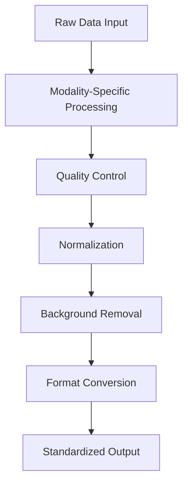

# Preprocessing Stage

## Overview

The preprocessing stage is the first step in the FOCUS pipeline, where raw data from each modality is cleaned, normalized, and converted to standardized formats. This stage ensures that all modalities are in a consistent state for subsequent alignment and registration.

## Preprocessing Workflow



## Modality-Specific Preprocessing

Each modality undergoes specialized processing tailored to its data characteristics:

### 1. Microscopy Image Preprocessing

**Input Formats**: `.tiff`, `.tif`, `.czi`
**Output Format**: OME-TIFF pyramid

**Processing Steps**:

1. **File Loading and Validation**
   - Detect file format (TIFF vs CZI)
   - Validate image dimensions and channels
   - Convert to float32 [0,1] range

2. **Color Enhancement** (optional)
   - Gamma correction: `I_corrected = I_original^gamma`
   - Contrast stretching: Linear stretch to use full dynamic range
   - Applied per-channel for multi-channel images

3. **Background Removal** (optional)
   - Otsu thresholding for binary mask
   - Morphological opening (erosion + dilation)
   - Remove small objects (< 1000 pixels)
   - Fill holes in tissue mask

4. **Tissue Cropping** (optional)
   - Compute tissue bounding box
   - Add margin (default: 250 pixels)
   - Crop image to tissue region

5. **Pyramid Construction**
   - Create multi-resolution OME-TIFF
   - Levels: 0 (full), 1 (1/2), 2 (1/4), etc.
   - Each level: 2× downsampling
   - OME-XML metadata generation

**Parameters**:
- `color_enhancement`: Enable/disable (default: true)
- `gamma`: Gamma value (default: 1.0, range: 0.1-3.0)
- `contrast_stretch`: Stretch factor (default: 1.0, range: 0.1-5.0)
- `background_removal`: Enable/disable (default: true)
- `background_threshold`: Otsu sensitivity (default: 0.1, range: 0.0-1.0)
- `crop_to_tissue`: Enable/disable (default: true)
- `tissue_margin`: Additional margin in pixels (default: 250, range: 0-1000)
- `resolution_level`: Pyramid level to use (default: 0, range: 0-5)

**Output Files**:
```
<dataset_path>/<sample_id>/preprocessing/microscopy/
├── <sample_id>_processed.ome.tiff	# Multi-resolution pyramid
└── <sample_id>_processed_thumbnail.png	# Preview image
```

**Quality Metrics**:
- Tissue area (pixels and µm²)
- Background percentage
- Dynamic range (min/max intensity)
- Channel statistics (mean/std per channel)

---

### 2. MSI (Mass Spectrometry Imaging) Preprocessing

**Input Formats**: `.imzML` + `.ibd`
**Output Format**: AnnData (`.h5ad`)

**Processing Steps**:

1. **Metadata Parsing**
   - Parse imzML XML for instrument parameters
   - Extract m/z range, ion mode, spatial dimensions
   - Validate file integrity

2. **Binary Data Loading**
   - Read IBD file for intensity values
   - Handle continuous vs processed mode
   - Memory-mapped reading for large files

3. **Dual Ion Mode Handling** (if applicable)
   - Separate positive and negative ion data
   - Align coordinates between modes
   - Create separate AnnData objects

4. **Intensity Normalization**
   - **TIC**: Total Ion Current normalization
   - **Max**: Normalize to maximum intensity
   - **None**: Raw intensities

5. **Background Detection** (optional)
   - Gaussian Mixture Model (GMM) on intensity distribution
   - Two components: foreground vs background
   - Probability threshold for classification

6. **m/z Recalibration** (optional)
   - Identify reference peaks (known lipids)
   - Compute mass accuracy correction
   - Apply linear correction to all m/z values

7. **Lipid Annotation** (optional)
   - Match m/z to lipid database
   - Apply ppm tolerance filter
   - Add annotation to feature metadata

8. **Intensity Interpolation**
   - Create reference m/z grid
   - Interpolate intensities to grid
   - Handle missing values

9. **Clustering**
   - Leiden clustering on interpolated data
   - Add cluster labels to observations

**Parameters**:
- `ion_mode`: "positive", "negative", or "both" (default: "positive")
- `mass_range`: [min_mz, max_mz] (default: [100, 1000])
- `intensity_normalization`: "tic", "max", or "none" (default: "tic")
- `background_detection`: Enable/disable (default: true)
- `recalibration`: Enable/disable (default: true)
- `lipid_annotation`: Enable/disable (default: true)
- `ppm_tolerance`: Mass accuracy tolerance (default: 10.0, range: 1-50)
- `min_intensity`: Minimum intensity threshold (default: 0.0)
- `max_intensity`: Maximum intensity threshold (default: 1e6)

**Output Files**:
```
<dataset_path>/<sample_id>/preprocessing/msi/
├── <sample_id>_processed.h5ad		# AnnData object
├── <sample_id>_positive.h5ad		# If dual ion mode
└── <sample_id>_negative.h5ad		# If dual ion mode
```

**AnnData Structure**:
- `X`: Raw interpolated intensities (spots × m/z features)
- `layers["X_tic"]`: TIC-normalized intensities
- `layers["X_max"]`: Max-normalized intensities
- `obsm["spatial"]`: Physical coordinates (µm)
- `obsm["raster_coordinates"]`: Pixel coordinates
- `obs["foreground"]`: Background detection mask
- `obs["leiden"]`: Cluster labels
- `var["mz"]`: m/z values
- `var["mz_mode"]`: Ion mode
- `var["lipid_annotation"]`: Lipid class
- `uns["raster_size"]`: Raster dimensions
- `uns["instrument"]`: Instrument parameters

**Quality Metrics**:
- Number of detected features
- Background spot percentage
- Mass accuracy (before/after recalibration)
- Annotation rate (if lipid annotation enabled)
- Cluster quality metrics

---

### 3. Raman Spectroscopy Preprocessing

**Input Formats**: `.lif` (Leica format)
**Output Format**: OME-TIFF (hyperspectral)

**Processing Steps**:

1. **File Parsing**
   - Parse LIF XML metadata
   - Extract scan parameters (wavenumber range, resolution)
   - Validate tile information

2. **Data Extraction**
   - Handle tiled acquisitions
   - Extract hyperspectral cubes
   - Manage wavenumber overlaps

3. **BaSiC Correction** (optional)
   - Background and shading correction
   - Uses external FOCUS_BaSiCpy environment
   - Subprocess call for each spectral channel

4. **Background Removal** (optional)
   - Quick-stitch tiles for preview
   - Otsu thresholding on stitched mosaic
   - Back-project mask to individual tiles

5. **Spectral Cleaning** (optional)
   - **Despiking**: Cosmic ray removal
   - **Denoising**: Wavelet-based denoising
   - **Baseline**: Polynomial baseline correction
   - **Normalization**: Area normalization

6. **ASHLAR Stitching** (optional)
   - Tile stitching using ASHLAR
   - Uses external FOCUS_ASHLAR environment
   - Corrects stitching artifacts

7. **OME-TIFF Construction**
   - Create hyperspectral OME-TIFF
   - Store wavenumber information in metadata
   - Multi-resolution pyramid

**Parameters**:
- `wavenumber_range`: [min_cm⁻¹, max_cm⁻¹] (default: [400, 1800])
- `basic_correction`: Enable/disable (default: true)
- `background_removal`: Enable/disable (default: true)
- `ashlar_stitching`: Enable/disable (default: true)
- `despike`: Enable/disable (default: true)
- `denoise`: Enable/disable (default: true)
- `baseline_correction`: Enable/disable (default: true)
- `normalization`: Enable/disable (default: true)

**Output Files**:
```
<dataset_path>/<sample_id>/preprocessing/raman/
├── <sample_id>_processed.ome.tiff	# Hyperspectral OME-TIFF
└── <sample_id>_processed_metadata.json	# Scan parameters
```

**Quality Metrics**:
- Signal-to-noise ratio
- Background removal effectiveness
- Stitching quality metrics
- Spectral range coverage

---

### 4. Spatial Transcriptomics Preprocessing

**Input Formats**: AnnData (`.h5ad`)
**Output Format**: AnnData (`.h5ad`)

**Processing Steps**:

1. **File Discovery**
   - Find first `.h5ad` file in sample directory
   - Validate AnnData structure
   - Check required fields (`X`, `obs`, `var`)

2. **Quality Control**
   - Calculate mitochondrial gene percentage
   - Filter cells by gene count thresholds
   - Remove low-quality cells

3. **Gene Filtering**
   - Filter genes by expression frequency
   - Remove rarely expressed genes
   - Filter by count/spots ratio

4. **Normalization**
   - Total counts normalization
   - Log1p transformation
   - Scale to median total counts

5. **Highly Variable Gene Selection**
   - Compute mean-variance relationship
   - Select top N variable genes
   - Add HVG information to `var`

6. **Metadata Enhancement**
   - Add processing timestamps
   - Store QC metrics
   - Add FOCUS version information

**Parameters**:
- `qc_mito_threshold`: Mitochondrial gene % (default: 0.2, range: 0.0-1.0)
- `min_genes_per_spot`: Minimum genes (default: 200, range: 50-10000)
- `max_genes_per_spot`: Maximum genes (default: 5000, range: >min_genes)
- `min_cells_per_gene`: Minimum cells per gene (default: 3, range: 1-100)
- `normalization`: "total_counts" or "none" (default: "total_counts")
- `log_transform`: Enable/disable (default: true)
- `n_hvgs`: Number of HVGs (default: 2000, range: 100-10000)

**Output Files**:
```
<dataset_path>/<sample_id>/preprocessing/st/
└── <sample_id>_processed.h5ad		# Processed AnnData
```

**AnnData Structure**:
- `X`: Normalized, log-transformed counts
- `raw.X`: Raw counts (if not overwritten)
- `obs["n_genes"]`: Number of genes per spot
- `obs["percent_mito"]`: Mitochondrial gene percentage
- `obs["total_counts"]`: Total counts per spot
- `var["n_cells"]`: Number of cells per gene
- `var["highly_variable"]`: HVG boolean
- `var["means"]`: Mean expression
- `var["dispersions"]`: Dispersion values
- `uns["focus_version"]`: Processing version
- `uns["qc_metrics"]`: Quality control metrics

**Quality Metrics**:
- Median genes per spot
- Median counts per spot
- Percentage mitochondrial genes
- Number of HVGs selected
- Cells filtered by QC

---

## Cross-Modality Processing

### Sample Discovery

FOCUS automatically discovers samples by:

1. **Scanning Dataset Directory**: List subdirectories of `dataset_path`
2. **Sample Identification**: Each subdirectory = one sample
3. **Modality Matching**: Look for directories matching modality names
4. **File Discovery**: Find appropriate files for each modality

**Directory Structure**:
```
<dataset_path>/
├── sample_001/			# Sample 1
│   ├── microscopy/		# Modality directory
│   │   ├── image1.tiff	# Input files
│   │   └── image2.tiff
│   └── msi/			# Modality directory
│       ├── data.imzML
│       └── data.ibd
├── sample_002/			# Sample 2
│   ├── microscopy/
│   └── msi/
└── ...
```

**IMPORTANT CORRECTION**: The above directory structure example is incorrect. Here are the **correct** file requirements:

```
<dataset_path>/
├── sample_001/
│   ├── microscopy/			# Must match config modality name
│   │   └── image.tiff			# Single TIFF/CZI file per sample
│   ├── msi/					# Must match config modality name
│   │   ├── pos/				# Positive ion mode (required)
│   │   │   ├── data.imzML		# imzML metadata
│   │   │   └── data.ibd		# Binary data
│   │   └── neg/				# Negative ion mode (optional)
│   │       ├── data.imzML		# imzML metadata
│   │       └── data.ibd		# Binary data
│   ├── raman/				# Must match config modality name
│   │   └── scan.lif			# Single LIF file per sample
│   ├── st/					# Must match config modality name
│   │   └── expression.h5ad		# Single AnnData file per sample
│   └── microscopy/			# Spatial annotations (if enabled)				
│       └── annotations.geojson	# GeoJSON annotations
├── sample_002/
│   ├── microscopy/			# Must have same modalities as sample_001
│   ├── msi/					# Must have same modalities as sample_001
│   ├── raman/					# Must have same modalities as sample_001
│   ├── st/					# Must have same modalities as sample_001
│   └── microscopy/			# Spatial annotations (if enabled)				
│       └── annotations.geojson	# GeoJSON annotations
└── ...
```

**File Requirements by Modality**:

- **Microscopy**: Exactly **one** TIFF or CZI file per sample
- **Raman**: Exactly **one** LIF file per sample  
- **MSI**:
  - Positive ion mode: 2 files (`data.imzML` + `data.ibd`) in `pos/` subfolder
  - Negative ion mode: 2 files (`data.imzML` + `data.ibd`) in `neg/` subfolder
  - Both modes: 4 files total
- **Spatial Transcriptomics**: Exactly **one** AnnData (`.h5ad`) file per sample
- **Spatial Annotations** (if enabled): Exactly **one** GeoJSON file per sample

**Critical Requirements**:

1. **Consistency**: Once a modality is defined in configuration, it must be present for **every sample**
2. **Naming**: Modality directory names must exactly match (case-sensitive) the config `"name"` field
3. **Annotations**: If spatial annotations enabled, all samples must have annotation files

### Parallel Processing

FOCUS processes samples in parallel:

1. **Sample-Level Parallelism**: Each sample processed independently
2. **Modality Parallelism**: Modalities within sample processed sequentially
3. **CPU Core Management**: Respects `max_cpu_cores` setting

**Parallelization Strategy**:
- Preprocessing stage: Sample-parallel
- Alignment stage: Sample-sequential (GUI interaction)
- Registration stage: Sample-parallel
- Compilation stage: Single-threaded

### Caching Mechanism

FOCUS implements intelligent caching:

1. **Cache Key Generation**:
   - Source file paths
   - Processing parameters
   - FOCUS version
   - Timestamp of source files

2. **Cache Validation**:
   - Check if cache key matches current run
   - Verify output files exist and are complete
   - Validate file checksums

3. **Cache Bypass**:
   - `force_recomputing: true` in config
   - `force_recomputing: true` in modality settings
   - Manual cache deletion

**Cache Locations**:
- Default: `~/.focus/cache/`
- Configurable via `cache_dir` parameter
- Organized by dataset and modality

---

## Data Flow and File Naming

### Output Directory Structure

```
<dataset_path>/
├── sample_001/
│   ├── preprocessing/
│   │   ├── microscopy/
│   │   │   ├── sample_001_processed.ome.tiff
│   │   │   └── sample_001_processed_thumbnail.png
│   │   ├── msi/
│   │   │   └── sample_001_processed.h5ad
│   │   └── ...
│   └── ...
├── sample_002/
│   └── preprocessing/
│       └── ...
└── merged/
    └── preprocessing/
        ├── microscopy/
        │   ├── microscopy_merged_processed.ome.tiff
        │   └── microscopy_merged_processed_thumbnail.png
        ├── msi/
        │   └── msi_merged_processed.h5ad
        └── ...
```

### File Naming Convention

FOCUS uses consistent naming patterns:

**Per-Sample Files**:
- `<modality>_<sample_id>_processed.<ext>`
- Example: `microscopy_sample_001_processed.ome.tiff`

**Merged Files**:
- `<modality>_merged_processed.<ext>`
- Example: `msi_merged_processed.h5ad`

**Extension Mapping**:
- Microscopy: `.ome.tiff`
- MSI: `.h5ad`
- Raman: `.ome.tiff`
- ST: `.h5ad`

---

## Quality Control and Validation

### Automated Quality Checks

FOCUS performs automatic validation:

1. **File Integrity**:
   - Check file sizes > 0
   - Validate file formats
   - Verify required metadata

2. **Data Consistency**:
   - Spatial dimensions match expectations
   - Coordinate systems are valid
   - Intensity ranges are reasonable

3. **Processing Success**:
   - Output files created successfully
   - No NaN/inf values in data
   - Metadata complete

### Quality Metrics Reporting

FOCUS generates quality metrics for each sample:

**Common Metrics**:
- Processing time per sample
- Input/output file sizes
- Memory usage peaks
- CPU utilization

**Modality-Specific Metrics**:
- Microscopy: Tissue area, background %, dynamic range
- MSI: Features detected, background spots, mass accuracy
- Raman: SNR, stitching quality, spectral range
- ST: Median genes, % mitochondrial, HVGs selected

**Reporting**:
- Logged to pipeline log files
- Stored in AnnData `uns` where applicable
- Available in final MuData object

---

## Performance Optimization

### Memory Management

1. **Streaming Processing**:
   - Large files processed in chunks
   - Memory-mapped file access
   - Out-of-core computation where possible

2. **Garbage Collection**:
   - Explicit `gc.collect()` calls
   - Memory cleanup between samples
   - Monitor memory usage in logs

3. **Batch Processing**:
   - Configurable batch sizes
   - Memory limits respected
   - Automatic batch size adjustment

### CPU Utilization

1. **Parallel Processing**:
   - Multi-threading for independent operations
   - Respects `max_cpu_cores` setting
   - Efficient thread pooling

2. **Load Balancing**:
   - Even distribution across samples
   - Dynamic workload adjustment
   - Prevents CPU starvation

3. **I/O Optimization**:
   - Buffered file operations
   - Minimized disk seeks
   - Efficient file caching

### GPU Acceleration

Note: GPU is not used in preprocessing stage (only in registration)

---

## Error Handling and Recovery

### Common Preprocessing Errors

| Error | Cause | Solution |
|-------|-------|----------|
| "File not found" | Missing input file | Verify file paths and permissions |
| "Invalid format" | Corrupt or wrong format | Check file integrity |
| "Memory error" | Insufficient RAM | Reduce batch size or samples |
| "Disk full" | Insufficient storage | Free up disk space |
| "Permission denied" | Access rights | Check directory permissions |

### Recovery Strategies

1. **Resume Processing**:
   - FOCUS automatically resumes from last successful sample
   - Failed samples are retried
   - Progress tracked in log files

2. **Selective Reprocessing**:
   - Use `force_recomputing: true` for specific modalities
   - Delete output files for failed samples
   - Rerun pipeline

3. **Debug Mode**:
   - Set `logging_level: "DEBUG"`
   - Detailed error information
   - Stack traces for troubleshooting

---

## Best Practices

### Configuration

1. **Start Conservative**: Begin with default parameters
2. **Test Small**: Process 1-2 samples first
3. **Validate Outputs**: Check intermediate files
4. **Iterate**: Adjust parameters based on results

### Data Organization

1. **Consistent Structure**: Follow exact directory layout
2. **Clear Naming**: Use descriptive sample/modality names
3. **Backup**: Keep originals of raw data
4. **Document**: Record processing parameters used

### Performance

1. **Monitor Resources**: Watch CPU/RAM/disk usage
2. **Optimize Batch Sizes**: Balance speed vs memory
3. **Use Caching**: Enable for repeated runs
4. **SSD Storage**: Recommended for large datasets

### Quality Control

1. **Review Logs**: Check for warnings/errors
2. **Inspect Outputs**: Validate intermediate files
3. **Check Metrics**: Review quality metrics
4. **Visual Inspection**: Spot-check processed data

---

## Troubleshooting

### Microscopy Issues

**Problem**: Poor background removal
- **Solution**: Adjust `background_threshold` (0.05-0.2 range)
- **Check**: Visual inspection of tissue mask

**Problem**: Over-cropping
- **Solution**: Increase `tissue_margin` (try 300-500)
- **Check**: Compare original vs cropped images

**Problem**: Color artifacts
- **Solution**: Disable `color_enhancement` or adjust `gamma`
- **Check**: Process with/without enhancement

### MSI Issues

**Problem**: No features detected
- **Solution**: Check `mass_range` and `ion_mode`
- **Check**: Validate against raw data parameters

**Problem**: High background
- **Solution**: Enable `background_detection`, adjust thresholds
- **Check**: Review background spot percentage

**Problem**: Poor annotation
- **Solution**: Adjust `ppm_tolerance`, verify ion mode
- **Check**: Check mass accuracy metrics

### Raman Issues

**Problem**: Stitching artifacts
- **Solution**: Ensure `ashlar_stitching` enabled
- **Check**: Visual inspection of stitched image

**Problem**: High noise
- **Solution**: Enable `denoise`, check acquisition parameters
- **Check**: Compare raw vs processed spectra

**Problem**: BaSiC failure
- **Solution**: Verify FOCUS_BaSiCpy environment
- **Check**: Test BaSiC correction separately

### ST Issues

**Problem**: Too many cells filtered
- **Solution**: Adjust `qc_mito_threshold` and gene count limits
- **Check**: Review QC metrics before/after filtering

**Problem**: No HVGs selected
- **Solution**: Increase `n_hvgs`, check data quality
- **Check**: Examine gene expression distribution

---

## Advanced Topics

### Custom Processing

FOCUS can be extended with custom processing:

```python
from focus.preprocessing import preprocess_modality

# Custom processing function
def custom_microscopy_processing(path, settings):
    # Your custom logic here
    result = preprocess_modality(
        path=path,
        modality_name="microscopy",
        modality_type="microscopy_image",
        preprocessing_settings=settings
    )
    # Additional post-processing
    return result
```

### Programmatic Access

Access preprocessing programmatically:

```python
from focus.preprocessing import preprocess_modality

result = preprocess_modality(
    path="/data/my_project",
    modality_name="microscopy",
    modality_type="microscopy_image",
    preprocessing_settings={
        "color_enhancement": True,
        "background_removal": True
    }
)

print(f"Processed files: {result}")
```

### Batch Processing

Process multiple datasets:

```bash
for dataset in dataset1 dataset2 dataset3; do
  focus --config ${dataset}/preprocessing_config.json
done
```

### Parameter Optimization

Optimize parameters systematically:

```python
import json
from focus.orchestrator import run
from focus.utils import parse_config

# Base configuration
base_config = {
    "dataset_path": "/data/test",
    "reference_modality": "microscopy",
    "perform_alignment": False,
    "perform_registration": False,
    "modalities": [{
        "name": "microscopy",
        "type": "microscopy_image",
        "processing_settings": {},
        "alignment_strategy": "manual",
        "registration_type": "none"
    }]
}

# Test different background thresholds
for threshold in [0.05, 0.1, 0.15, 0.2]:
    config = base_config.copy()
    config["modalities"][0]["processing_settings"]["background_threshold"] = threshold
    
    # Run preprocessing
    parsed_config = parse_config(config)
    output_files = run(parsed_config)
    
    # Evaluate results
    print(f"Threshold {threshold}: {output_files}")
```

---

## Next Steps

After preprocessing:

1. **Review Outputs**: Check processed files in `<dataset_path>/preprocessing/`
2. **Validate Quality**: Review quality metrics and logs
3. **Proceed to Alignment**: If satisfied, continue to [Alignment Stage](alignment.md)
4. **Troubleshoot**: Address any warnings/errors before proceeding

## Additional Resources

- [Alignment Documentation](alignment.md) - Next pipeline stage
- [Configuration Reference](../configuration/config_fields.md) - Preprocessing parameters
- [Troubleshooting Guide](../troubleshooting.md) - Common issues
- [FAQ](../faq.md) - Frequently asked questions