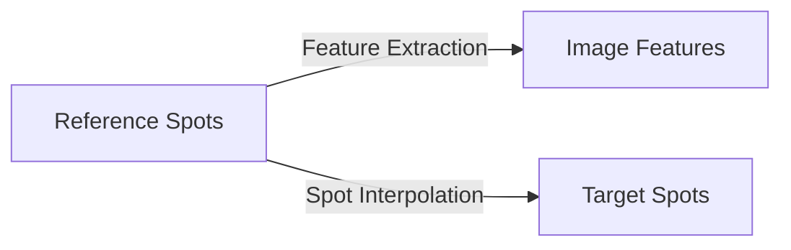

# Registration Stage

## Overview

The registration stage in FOCUS performs feature-based mapping between aligned modalities, enabling comprehensive multi-modal analysis. This stage aligns spatial coordinates and adjusts resolution by merging target modality spots to match the reference's spatial resolution, allowing each modality to retain its own feature space while enabling spatial alignment for integrated analysis.

## Registration Methods

FOCUS supports two primary registration methods:

### 1. Feature Extraction Registration

**Use Case**: Mapping microscopy images to spot-based reference

**Method**: Deep learning patch embeddings using Prov-GigaPath model

**Requirements**:
- NVIDIA GPU with CUDA
- HuggingFace token (for model download)
- Microscopy image modality as target

**Process**:
1. Extract patches at reference spot locations
2. Compute feature embeddings for each patch
3. Filter background patches
4. Construct feature matrix
5. Normalize features

### 2. Spot Interpolation Registration

**Use Case**: Mapping spot-based modalities (MSI, ST) to any reference

**Method**: Gaussian-weighted interpolation of features

**Requirements**:
- CPU-only (no GPU required)
- Spot-based modality as target
- Aligned coordinate systems

**Process**:
1. Identify k-nearest neighbors in target
2. Compute distance-weighted features
3. Interpolate features to reference coordinates
4. Construct feature matrix
5. Normalize features

## Feature Extraction Registration

### Technical Implementation

**Model Architecture**:
- **Backbone**: Prov-GigaPath (HuggingFace)
- **Input**: 224×224 RGB patches
- **Output**: 1536-dimensional embeddings
- **Normalization**: ImageNet statistics

**Patch Extraction**:
- Centered at reference spot coordinates
- Background filtering (Otsu thresholding)
- Batch processing for efficiency

**Feature Construction**:
```
Reference Spots × Patch Embeddings → Feature Matrix
```

### Configuration Parameters

```json
{
  "registration_type": "feature_extraction",
  "registration_settings": {
    "patch_size": 224,
    "min_max_rescale": false,
    "batch_size": 32,
    "force_recomputing": false
  }
}
```

**Parameter Details**:

| Parameter | Type | Default | Range | Description                         |
|-----------|------|---------|-------|-------------------------------------|
| `patch_size` | int | 224 | 64-512 | Size of extracted patches           |
| `min_max_rescale` | bool | true | - | Normalize output feature embeddings |
| `batch_size` | int | 32 | 1-128 | Patches per batch                   |
| `force_recomputing` | bool | false | - | Bypass cache                        |

### Processing Steps

1. **Patch Extraction**
   - Load reference AnnData with aligned coordinates
   - Extract patches at `obsm['{target}_spatial']` locations
   - Handle edge cases (near image boundaries)

2. **Background Filtering**
   - Compute mean intensity per patch
   - Apply Otsu threshold
   - Filter low-intensity patches

3. **Feature Extraction**
   - Load Prov-GigaPath model
   - Process patches in batches
   - Extract 1536-d embeddings

4. **Feature Matrix Construction**
   - Create matrix: Spots × Features
   - Handle missing patches (NaN)
   - Store in AnnData format

5. **Normalization**
   - Min-max scaling (if enabled)
   - Store features (with optional scaling)

### Output Structure

```
<dataset_path>/<sample_id>/registration/<target_mod>/
└── <sample_id>_processed_aligned_registered.h5ad	# Registered features
```

**AnnData Structure**:
- `X`: Feature matrix (Spots × 1536)

### Performance Considerations

**GPU Requirements**:
- **VRAM**: ~8GB for batch_size=32
- **CUDA**: 11.8+
- **Drivers**: Latest NVIDIA drivers

**Processing Time**:
- ~1-5 seconds per patch
- Batch processing parallelization
- Depends on GPU capabilities

**Memory Usage**:
- GPU memory: Scales with batch_size
- CPU memory: Minimal
- Disk: ~1GB per 1000 patches

### Error Handling

**Common Issues**:
- **GPU not available**: Fallback to CPU (slow)
- **Out of memory**: Reduce batch_size
- **Model download failed**: Check HuggingFace token
- **Invalid coordinates**: Verify alignment stage

**Recovery**:
```bash
# Reduce batch size
jq '.registration_settings.batch_size = 16' config.json > config_fixed.json

# Force recompute
jq '.registration_settings.force_recomputing = true' config.json > config_fixed.json
```

## Spot Interpolation Registration

### Technical Implementation

**Algorithm**: Gaussian-weighted k-nearest neighbors interpolation

**Distance Metric**: Euclidean distance in physical coordinates

**Weighting Function**:
```
weight_i = exp(-distance_i² / (2 * sigma²))
```

**Interpolation Formula**:
```
feature_j = Σ (weight_i * target_feature_i) / Σ weight_i
```

### Configuration Parameters

```json
{
  "registration_type": "spot_interpolation",
  "registration_settings": {
    "force_recomputing": false
  }
}
```

**Parameter Details**:

| Parameter | Type | Default | Range | Description |
|-----------|------|---------|-------|-------------|
| `force_recomputing` | bool | false | - | Bypass cache |

### Processing Steps

1. **Coordinate Loading**
   - Load reference AnnData with aligned coordinates
   - Load target AnnData with features
   - Extract coordinate systems

2. **Neighbor Search**
   - Build KD-tree from target coordinates
   - For each reference spot select all the target spots whose center is within the reference spot size.

3. **Feature Interpolation**
   - Compute distance weights
   - Apply weighting function
   - Interpolate features

4. **Feature Matrix Construction**
   - Create matrix: Reference Spots × Target Features
   - Store interpolation metadata

### Output Structure

```
<dataset_path>/<sample_id>/registration/<target_mod>/
└── <sample_id>_processed_aligned_registered.h5ad	# Registered features
```

**AnnData Structure**:
- `X`: Interpolated feature matrix

### Performance Considerations

**CPU Requirements**:
- Multi-threaded implementation
- Scales with resolution difference between target and reference
- Memory-efficient

**Processing Time**:
- ~0.1-1 seconds per spot
- Parallel processing across spots
- O(n log n) complexity

**Memory Usage**:
- Scales with dataset size
- KD-tree construction: O(n)
- Query memory: O(k)

## Registration Data Flow

### Input Requirements

For registration to work, FOCUS requires:

1. **Completed Alignment**: Successful alignment stage
2. **Valid Coordinates**: Aligned coordinate systems
3. **Compatible Modalities**: Supported registration pairs
4. **Feature Data**: Target modality must have features

### Supported Registration Combinations

| Reference Type | Target Type | Method | Notes |
|----------------|-------------|--------|-------|
| SPOT | IMAGE | Feature Extraction | Requires GPU |
| SPOT | SPOT | Spot Interpolation | CPU-only |
| IMAGE | SPOT | Not supported | - |
| IMAGE | IMAGE | Not supported | - |

**Type Definitions**:
- **IMAGE**: Microscopy, Raman
- **SPOT**: MSI, Spatial Transcriptomics

!!! warning "Raman modality handling"
    In the current FOCUS release, Raman data are treated as a **SPOT** modality for registration, so the `spot_interpolation` method is used. Future releases will add dedicated `feature_extraction` support for hyperspectral Raman images.

### Output Files

```
<dataset_path>/<sample_id>/registration/<target_modality>/
└── <sample_id>_processed_aligned_registered.h5ad	# Registered features
```

### Merged Registration Files

After all samples for a target modality are processed, the per-sample files are merged:

```
<dataset_path>/merged/registration/<target_modality>/
└── <target_modality>_merged_processed_aligned_registered.h5ad	# Combined features
```

## Multi-Modal Registration

### Registration Chaining

FOCUS supports chaining multiple registrations:



**Example Configuration**:
```json
{
  "modalities": [
    {
      "name": "microscopy",
      "type": "microscopy_image",
      "registration_type": "feature_extraction",
      "registration_settings": {
        "patch_size": 224,
        "batch_size": 16,
         "force_recomputing": true
      }
    },
    {
      "name": "msi",
      "type": "msi",
      "registration_type": "spot_interpolation",
      "registration_settings": {
        "force_recomputing": true
      }
    }
  ]
}
```

### Feature Space Integration

After registration, features are integrated into common space:

```
MuData Structure:
├── microscopy: [Spots × 1536 patch features]
├── msi: [Spots × N m/z features]
├── st: [Spots × M gene features]
└── obs: [Spots × metadata]
```

## Configuration Best Practices

### Method Selection

**Use Feature Extraction When**:
- GPU available
- Image-to-spot registration needed
- High accuracy required
- Patch-level features desired

**Use Spot Interpolation When**:
- CPU-only environment
- Spot-to-spot registration
- Fast processing needed
- Simple feature mapping sufficient

### Parameter Optimization

**Feature Extraction**:
- Start with default parameters
- Adjust batch_size based on GPU memory
- patch_size=224 for standard model
- min_max_rescale=false (unless downstream AI methods require features to be [0, 1])

**Spot Interpolation**:

No manual parameters required.

## Troubleshooting Registration Issues

### Common Problems and Solutions

**Problem**: GPU not detected
- **Check**: CUDA drivers and nvidia-smi
- **Solution**: Install CUDA toolkit

**Problem**: Out of GPU memory
- **Check**: Batch size and image size
- **Solution**: Reduce batch_size (try 8 or 16)

**Problem**: Model download failed
- **Check**: HuggingFace token
- **Solution**: Verify token and network

**Problem**: No features registered
- **Check**: Alignment completion
- **Solution**: Verify alignment output files
- **Alternative**: Rerun alignment stage

### Debugging Techniques

**Enable Debug Logging**:
```json
{
  "logging_level": "DEBUG"
}
```

**Check Intermediate Files**:
```bash
# List registration outputs
ls -la <dataset_path>/registration/

# Check file sizes
du -sh <dataset_path>/registration/*
```

**Validate Coordinates**:
```python
import anndata

# Load aligned data
aligned = anndata.read_h5ad("aligned.h5ad")

# Check coordinates
print("Reference coordinates:", aligned.obsm['spatial'][:5])
print("Target coordinates:", aligned.obsm['msi_spatial'][:5])
```

**Test Registration Programmatically**:
```python
from focus.registration import SpotInterpolationRegistration

registrar = SpotInterpolationRegistration("/data/project")
result = registrar.register_dataset(
    anchor_files={"sample_001": "aligned.h5ad"},
    target_files={"sample_001": "msi_processed.h5ad"},
    anchor_name="microscopy",
    target_name="msi",
)
```

## Advanced Registration Techniques

### Custom Feature Extraction

Extend with custom models:

```python
from focus.registration import FeatureExtractorRegistration

class CustomFeatureExtractor(FeatureExtractorRegistration):
    def _extract_features(self, image_path, coordinates):
        # Custom feature extraction logic
        # Return: features (n_spots × n_features)
        return custom_features

# Use in configuration
registrar = CustomFeatureExtractor("/data/project", hf_token="...")
```

### Dimensionality Reduction

Apply dimensionality reduction to registered features:

```python
import scanpy as sc

# Load registered data
registered = anndata.read_h5ad("registered.h5ad")

# Compute PCA
sc.pp.pca(registered, n_comps=50)

# Compute UMAP
sc.pp.neighbors(registered)
sc.tl.umap(registered)

# Visualize
sc.pl.umap(registered, color=["feature_1", "feature_2"])
```

## Next Steps

After successful registration:

1. **Review Registration**: Check quality metrics and feature distributions
2. **Proceed to Compilation**: Continue to [MuData Compilation](compilation.md)
3. **Validate Integration**: Perform cross-modality analysis
4. **Document Results**: Record registration parameters and quality

## Additional Resources

- [MuData Compilation Documentation](compilation.md) - Final pipeline stage
- [Configuration Reference](../configuration/config_fields.md) - Registration parameters
- [Alignment Documentation](alignment.md) - Previous stage
- [Troubleshooting Guide](../troubleshooting.md) - Common issues