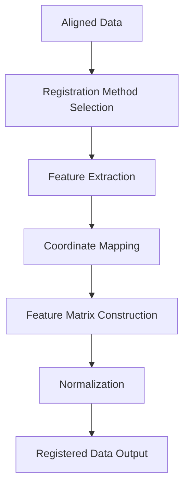
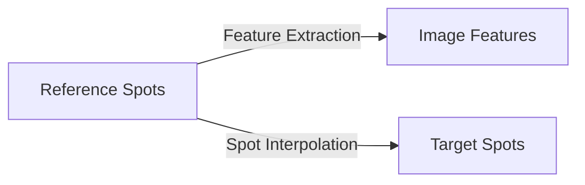

# Registration Stage

## Overview

The registration stage in FOCUS performs feature-based mapping between aligned modalities, enabling comprehensive multi-modal analysis. This stage creates a common feature space where data from different modalities can be directly compared and analyzed together.

## Registration Workflow



## Registration Methods

FOCUS supports two primary registration methods:

### 1. Feature Extraction Registration

**Use Case**: Mapping microscopy images to spot-based reference

**Method**: Deep learning patch embeddings using Prov-GigaPath model

**Requirements**:
- NVIDIA GPU with CUDA
- HuggingFace token (for model download)
- Microscopy image modality as target

**Process**:
1. Extract patches at reference spot locations
2. Compute feature embeddings for each patch
3. Filter background patches
4. Construct feature matrix
5. Normalize features

### 2. Spot Interpolation Registration

**Use Case**: Mapping spot-based modalities (MSI, ST) to any reference

**Method**: Gaussian-weighted interpolation of features

**Requirements**:
- CPU-only (no GPU required)
- Spot-based modality as target
- Aligned coordinate systems

**Process**:
1. Identify k-nearest neighbors in target
2. Compute distance-weighted features
3. Interpolate features to reference coordinates
4. Construct feature matrix
5. Normalize features

## Feature Extraction Registration

### Technical Implementation

**Model Architecture**:
- **Backbone**: Prov-GigaPath (HuggingFace)
- **Input**: 224×224 RGB patches
- **Output**: 1536-dimensional embeddings
- **Normalization**: ImageNet statistics

**Patch Extraction**:
- Centered at reference spot coordinates
- Background filtering (Otsu thresholding)
- Batch processing for efficiency

**Feature Construction**:
```
Reference Spots × Patch Embeddings → Feature Matrix
```

### Configuration Parameters

```json
{
  "registration_type": "feature_extraction",
  "registration_settings": {
    "patch_size": 224,
    "background_color": "white",
    "min_max_rescale": true,
    "gpu_device": 0,
    "batch_size": 32,
    "force_recomputing": false
  }
}
```

**Parameter Details**:

| Parameter | Type | Default | Range | Description |
|-----------|------|---------|-------|-------------|
| `patch_size` | int | 224 | 64-512 | Size of extracted patches |
| `background_color` | str | "white" | white/black | Background handling |
| `min_max_rescale` | bool | true | - | Normalize patch intensities |
| `gpu_device` | int | 0 | 0,1,2,... | GPU device ID |
| `batch_size` | int | 32 | 1-128 | Patches per batch |
| `force_recomputing` | bool | false | - | Bypass cache |

### Processing Steps

1. **Patch Extraction**
   - Load reference AnnData with aligned coordinates
   - Extract patches at `obsm['{target}_spatial']` locations
   - Handle edge cases (near image boundaries)

2. **Background Filtering**
   - Compute mean intensity per patch
   - Apply Otsu threshold
   - Filter low-intensity patches

3. **Feature Extraction**
   - Load Prov-GigaPath model
   - Process patches in batches
   - Extract 1536-d embeddings

4. **Feature Matrix Construction**
   - Create matrix: Spots × Features
   - Handle missing patches (NaN)
   - Store in AnnData format

5. **Normalization**
   - Min-max scaling (if enabled)
   - Z-score normalization
   - Store raw and normalized features

### Output Structure

```
<dataset_path>/<sample_id>/registration/microscopy_to_msi/
├── sample_001_registered.h5ad		# Registered features
├── patch_embeddings.npy			# Raw embeddings
└── registration_metadata.json		# Processing info
```

**AnnData Structure**:
- `X`: Normalized feature matrix (Spots × 1536)
- `layers["X_raw"]`: Raw embeddings
- `obs["patch_quality"]`: Background filter scores
- `var["feature_type"]`: "patch_embedding"
- `uns["registration_method"]`: "feature_extraction"
- `uns["model_info"]`: Model version and parameters

### Performance Considerations

**GPU Requirements**:
- **VRAM**: ~8GB for batch_size=32
- **CUDA**: 11.8+
- **Drivers**: Latest NVIDIA drivers

**Processing Time**:
- ~1-5 seconds per patch
- Batch processing parallelization
- Depends on GPU capabilities

**Memory Usage**:
- GPU memory: Scales with batch_size
- CPU memory: Minimal
- Disk: ~1GB per 1000 patches

### Error Handling

**Common Issues**:
- **GPU not available**: Fallback to CPU (slow)
- **Out of memory**: Reduce batch_size
- **Model download failed**: Check HuggingFace token
- **Invalid coordinates**: Verify alignment stage

**Recovery**:
```bash
# Reduce batch size
jq '.registration_settings.batch_size = 16' config.json > config_fixed.json

# Force recompute
jq '.registration_settings.force_recomputing = true' config.json > config_fixed.json
```

## Spot Interpolation Registration

### Technical Implementation

**Algorithm**: Gaussian-weighted k-nearest neighbors interpolation

**Distance Metric**: Euclidean distance in physical coordinates

**Weighting Function**:
```
weight_i = exp(-distance_i² / (2 * sigma²))
```

**Interpolation Formula**:
```
feature_j = Σ (weight_i * target_feature_i) / Σ weight_i
```

### Configuration Parameters

```json
{
  "registration_type": "spot_interpolation",
  "registration_settings": {
    "k_neighbors": 5,
    "max_distance": 100.0,
    "weighting": "distance",
    "force_recomputing": false
  }
}
```

**Parameter Details**:

| Parameter | Type | Default | Range | Description |
|-----------|------|---------|-------|-------------|
| `k_neighbors` | int | 5 | 1-20 | Number of neighbors |
| `max_distance` | float | 100.0 | >0 | Maximum search radius (µm) |
| `weighting` | str | "distance" | distance/uniform | Weighting method |
| `force_recomputing` | bool | false | - | Bypass cache |

### Processing Steps

1. **Coordinate Loading**
   - Load reference AnnData with aligned coordinates
   - Load target AnnData with features
   - Extract coordinate systems

2. **Neighbor Search**
   - Build KD-tree from target coordinates
   - Query k-nearest neighbors for each reference spot
   - Apply distance filter

3. **Feature Interpolation**
   - Compute distance weights
   - Apply weighting function
   - Interpolate features

4. **Quality Control**
   - Compute interpolation confidence
   - Flag low-confidence spots
   - Handle edge cases

5. **Feature Matrix Construction**
   - Create matrix: Reference Spots × Target Features
   - Store interpolation metadata

### Output Structure

```
<dataset_path>/<sample_id>/registration/msi_to_st/
├── sample_001_registered.h5ad		# Registered features
└── registration_metadata.json		# Processing info
```

**AnnData Structure**:
- `X`: Interpolated feature matrix
- `layers["X_raw"]`: Original target features
- `obs["interpolation_confidence"]`: Quality scores
- `obs["n_neighbors_used"]`: Neighbors per spot
- `var["feature_type"]`: "interpolated"
- `uns["registration_method"]`: "spot_interpolation"
- `uns["interpolation_params"]`: k, max_distance, etc.

### Performance Considerations

**CPU Requirements**:
- Multi-threaded implementation
- Scales with k_neighbors
- Memory-efficient

**Processing Time**:
- ~0.1-1 seconds per spot
- Parallel processing across spots
- O(n log n) complexity

**Memory Usage**:
- Scales with dataset size
- KD-tree construction: O(n)
- Query memory: O(k)

### Error Handling

**Common Issues**:
- **No neighbors found**: Increase max_distance or k
- **Low confidence**: Check coordinate alignment
- **Memory error**: Process in smaller batches
- **Coordinate mismatch**: Verify alignment stage

**Recovery**:
```bash
# Increase search radius
jq '.registration_settings.max_distance = 200' config.json > config_fixed.json

# Use uniform weighting
jq '.registration_settings.weighting = "uniform"' config.json > config_fixed.json
```

## Registration Data Flow

### Input Requirements

For registration to work, FOCUS requires:

1. **Completed Alignment**: Successful alignment stage
2. **Valid Coordinates**: Aligned coordinate systems
3. **Compatible Modalities**: Supported registration pairs
4. **Feature Data**: Target modality must have features

### Supported Registration Combinations

| Reference Type | Target Type | Method | Notes |
|----------------|-------------|--------|-------|
| SPOT | IMAGE | Feature Extraction | Requires GPU |
| SPOT | SPOT | Spot Interpolation | CPU-only |
| IMAGE | SPOT | Not supported | - |
| IMAGE | IMAGE | Not supported | - |

**Type Definitions**:
- **IMAGE**: Microscopy, Raman
- **SPOT**: MSI, Spatial Transcriptomics

### Output Files

```
<dataset_path>/<sample_id>/registration/
├── microscopy_to_msi/		# Reference → Target
│   ├── sample_001_registered.h5ad	# Registered features
│   ├── patch_embeddings.npy		# If feature extraction
│   └── registration_metadata.json	# Processing metadata
├── msi_to_st/				# If multiple registrations
│   └── ...
└── ...
```

### Merged Registration Files

After all samples processed:

```
<dataset_path>/merged/registration/
├── microscopy_to_msi/
│   ├── merged_registered.h5ad		# Combined features
│   └── registration_metadata.json	# Aggregate metadata
└── ...
```

## Multi-Modal Registration

### Registration Chaining

FOCUS supports chaining multiple registrations:



**Example Configuration**:
```json
{
  "modalities": [
    {
      "name": "microscopy",
      "type": "microscopy_image",
      "registration_type": "feature_extraction",
      "registration_settings": {
        "patch_size": 224,
        "batch_size": 16
      }
    },
    {
      "name": "msi",
      "type": "msi",
      "registration_type": "spot_interpolation",
      "registration_settings": {
        "k_neighbors": 5,
        "max_distance": 75.0
      }
    }
  ]
}
```

### Feature Space Integration

After registration, features are integrated into common space:

```
MuData Structure:
├── microscopy: [Spots × 1536 patch features]
├── msi: [Spots × N m/z features]
├── st: [Spots × M gene features]
└── obs: [Spots × metadata]
```

## Quality Control and Validation

### Registration Quality Metrics

FOCUS computes comprehensive quality metrics:

**Feature Extraction**:
- Patch extraction success rate
- Background filtering percentage
- Embedding variance
- Batch processing statistics

**Spot Interpolation**:
- Mean neighbors per spot
- Interpolation confidence scores
- Distance distribution
- Coverage percentage

### Visual Validation

**Feature Distribution**:
- PCA/t-SNE of registered features
- UMAP visualization
- Cluster analysis

**Spatial Patterns**:
- Feature heatmaps
- Spatial autocorrelation
- Neighborhood analysis

**Integration Quality**:
- Cross-modality correlation
- Feature similarity
- Dimensionality reduction

### Quantitative Validation

**Metrics Calculated**:
- Feature variance explained
- Cross-modality correlation
- Spatial consistency
- Batch effects

**Acceptance Criteria**:
- >80% variance explained (typical)
- Consistent spatial patterns
- Biological plausibility
- No obvious artifacts

## Configuration Best Practices

### Method Selection

**Use Feature Extraction When**:
- GPU available
- Image-to-spot registration needed
- High accuracy required
- Patch-level features desired

**Use Spot Interpolation When**:
- CPU-only environment
- Spot-to-spot registration
- Fast processing needed
- Simple feature mapping sufficient

### Parameter Optimization

**Feature Extraction**:
- Start with default parameters
- Adjust batch_size based on GPU memory
- patch_size=224 for standard model
- min_max_rescale=true for consistency

**Spot Interpolation**:
- k_neighbors=5 good starting point
- max_distance based on spot density
- weighting="distance" for most cases
- Increase k for smoother results

### Performance Tuning

**GPU Optimization**:
- Monitor GPU utilization
- Adjust batch_size for memory
- Use multiple GPUs if available
- Enable CUDA optimizations

**CPU Optimization**:
- Set max_cpu_cores appropriately
- Use parallel processing
- Monitor memory usage
- Optimize neighbor search

## Troubleshooting Registration Issues

### Common Problems and Solutions

**Problem**: GPU not detected
- **Check**: CUDA drivers and nvidia-smi
- **Solution**: Install CUDA toolkit
- **Alternative**: Use spot interpolation

**Problem**: Out of GPU memory
- **Check**: Batch size and image size
- **Solution**: Reduce batch_size (try 8 or 16)
- **Alternative**: Use smaller patch_size

**Problem**: Model download failed
- **Check**: HuggingFace token
- **Solution**: Verify token and network
- **Alternative**: Manual model download

**Problem**: No features registered
- **Check**: Alignment completion
- **Solution**: Verify alignment output files
- **Alternative**: Rerun alignment stage

**Problem**: Low interpolation confidence
- **Check**: Coordinate alignment
- **Solution**: Review alignment quality
- **Alternative**: Increase max_distance

### Debugging Techniques

**Enable Debug Logging**:
```json
{
  "logging_level": "DEBUG"
}
```

**Check Intermediate Files**:
```bash
# List registration outputs
ls -la <dataset_path>/registration/

# Check file sizes
du -sh <dataset_path>/registration/*
```

**Validate Coordinates**:
```python
import anndata

# Load aligned data
aligned = anndata.read_h5ad("aligned.h5ad")

# Check coordinates
print("Reference coordinates:", aligned.obsm['spatial'][:5])
print("Target coordinates:", aligned.obsm['msi_spatial'][:5])
```

**Test Registration Programmatically**:
```python
from focus.registration import SpotInterpolationRegistration

registrar = SpotInterpolationRegistration("/data/project")
result = registrar.register_dataset(
    anchor_files={"sample_001": "aligned.h5ad"},
    target_files={"sample_001": "msi_processed.h5ad"},
    anchor_name="microscopy",
    target_name="msi",
    k_neighbors=5,
    max_distance=100.0
)
```

## Advanced Registration Techniques

### Custom Feature Extraction

Extend with custom models:

```python
from focus.registration import FeatureExtractorRegistration

class CustomFeatureExtractor(FeatureExtractorRegistration):
    def _extract_features(self, image_path, coordinates):
        # Custom feature extraction logic
        # Return: features (n_spots × n_features)
        return custom_features

# Use in configuration
registrar = CustomFeatureExtractor("/data/project", hf_token="...")
```

### Multi-Modal Feature Fusion

Combine features from multiple registrations:

```python
import anndata
import numpy as np

# Load registered data
microscopy_features = anndata.read_h5ad("microscopy_registered.h5ad")
msi_features = anndata.read_h5ad("msi_registered.h5ad")

# Concatenate features
combined_X = np.hstack([
    microscopy_features.X,
    msi_features.X
])

# Create combined AnnData
combined = anndata.AnnData(combined_X)
combined.obs = microscopy_features.obs.copy()
combined.var["feature_source"] = ["microscopy"]*1536 + ["msi"]*msi_features.n_vars
```

### Dimensionality Reduction

Apply dimensionality reduction to registered features:

```python
import scanpy as sc

# Load registered data
registered = anndata.read_h5ad("registered.h5ad")

# Compute PCA
sc.pp.pca(registered, n_comps=50)

# Compute UMAP
sc.pp.neighbors(registered)
sc.tl.umap(registered)

# Visualize
sc.pl.umap(registered, color=["feature_1", "feature_2"])
```

## Best Practices

### Workflow Optimization

1. **Registration Planning**:
   - Determine required registrations
   - Plan registration order
   - Estimate resource requirements
   - Document registration strategy

2. **Quality Assurance**:
   - Validate each registration
   - Check feature distributions
   - Verify spatial patterns
   - Document quality metrics

3. **Resource Management**:
   - Monitor GPU/CPU usage
   - Manage memory constraints
   - Optimize batch sizes
   - Plan for large datasets

### Data Integration

1. **Feature Harmonization**:
   - Normalize feature scales
   - Handle missing values
   - Standardize feature names
   - Document feature sources

2. **Metadata Preservation**:
   - Retain original metadata
   - Track processing history
   - Store registration parameters
   - Document quality metrics

3. **Validation Strategy**:
   - Biological validation
   - Technical validation
   - Statistical validation
   - Visual validation

### Performance Monitoring

1. **Resource Tracking**:
   - Monitor GPU memory
   - Track CPU utilization
   - Watch disk I/O
   - Log performance metrics

2. **Progress Monitoring**:
   - Review log files
   - Check intermediate outputs
   - Validate partial results
   - Estimate completion time

3. **Optimization**:
   - Adjust batch sizes
   - Tune parallelization
   - Optimize memory usage
   - Balance speed vs quality

## Next Steps

After successful registration:

1. **Review Registration**: Check quality metrics and feature distributions
2. **Proceed to Compilation**: Continue to [MuData Compilation](compilation.md)
3. **Validate Integration**: Perform cross-modality analysis
4. **Document Results**: Record registration parameters and quality

## Additional Resources

- [MuData Compilation Documentation](compilation.md) - Final pipeline stage
- [Configuration Reference](../configuration/config_fields.md) - Registration parameters
- [Alignment Documentation](alignment.md) - Previous stage
- [Troubleshooting Guide](../troubleshooting.md) - Common issues