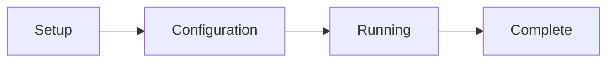

# GUI Usage Guide

## Starting the GUI

### Method 1: Direct Command

```bash
# Activate FOCUS environment
conda activate FOCUS

# Start GUI
focus
```

### Method 2: Container Deployment

```bash
# Start GUI in container
bash focus-container.sh --mount /path/to/your/data
```

### Method 3: Windows

```batch
conda activate FOCUS
focus
```

## GUI Interface Overview

The FOCUS GUI consists of four main stages:



### Stage 1: Setup

**Purpose**: Define your dataset location and configuration approach

**Interface Elements:**
- **Dataset Path**: Browse to your dataset directory
- **Load Config**: Load an existing configuration file
- **New Config**: Start a new configuration from scratch
- **Next**: Proceed to configuration stage

**Actions:**
1. Click **Browse** to select your dataset directory
2. Choose **New Config** for first-time setup or **Load Config** to modify existing
3. Click **Next** to continue

### Stage 2: Configuration

**Purpose**: Define modalities, processing parameters, and pipeline settings

**Main Sections:**

#### Dataset Settings
- **Dataset Path**: Displayed from setup stage
- **Reference Modality**: Select which modality serves as the coordinate reference

Outputs are always written back under `dataset_path` (the final dataset lands at
`<dataset_path>/merged/multimodal_dataset.h5mu`); there is no separate output-directory
field.

#### Modality Configuration

**Adding Modalities:**
1. Click **Add Modality** button
2. Select modality type from dropdown:
   - Microscopy Image
   - MSI (Mass Spectrometry Imaging)
   - Raman Spectroscopy Imaging
   - Spatial Transcriptomics
3. Enter modality name (must match directory names)
4. Configure modality-specific settings

**Modality-Specific Settings:**

**Microscopy Image:**
- **Input Format**: OME-TIFF, qpTIFF, TIFF, or CZI
- **Color Enhancement**: Enable/disable gamma correction and contrast stretching
- **Background Removal**: Enable/disable and choose the fill colour (white or black)
- **Crop to Tissue**: Enable/disable with margin size

!!! note
    The number of OME-TIFF pyramid levels is computed automatically from the image size and is not a GUI setting.

**MSI (Mass Spectrometry Imaging):**
- **Intensity Normalization**: None/TIC/Log/CLR
- **Background Detection**: Enable/disable GMM-based detection
- **Recalibration**: Enable/disable m/z recalibration
- **Lipid Annotation**: Enable/disable lipid database matching

!!! note
    Ion mode is not a GUI setting. Each sample's ion modes are detected from its data: an ion mode is used when its `pos/` or `neg/` subfolder holds a complete `.imzML` + `.ibd` pair. The GUI creates both subfolders for every MSI sample. If you only have one ion mode, leave the other empty.

**Raman Spectroscopy Imaging:**
- **Wavenumber Range**: Range to process
- **BaSiC Correction**: Enable/disable
- **Background Removal**: Enable/disable
- **ASHLAR Stitching**: Enable/disable
- **Spectral Cleaning**: Despike, denoise, baseline options

**Spatial Transcriptomics:**
- **Spot filters**: Min/Max Count Per Spot, Min/Max Genes Per Spot (leave blank to disable)
- **Gene filters**: Min Spots Per Gene, Min Count Spots Ratio Per Gene (applied to the merged dataset)
- **Remove Mitochondrial Genes**: Enable/disable
- **Total Counts Normalize**: Enable/disable (scales each spot to 10,000 counts)
- **Log1p Transform**: Enable/disable

!!! note
    Every spot filter, gene filter and normalisation step is off by default. With defaults, `.X` in the output holds the raw counts from your input file. There is no highly-variable-gene selection.

#### Processing Options

**Preprocessing:**
- **Force Recomputing**: Reprocess all files even if cached

**Alignment:**
- **Perform Alignment**: Enable/disable alignment stage
- **Alignment Strategy**: Manual (GUI) or Pre-aligned
- **Force Recomputing**: Re-run alignment even if cached

**Registration:**
- **Perform Registration**: Enable/disable registration stage
- **Registration Type**: Feature Extraction (GPU) or Spot Interpolation (CPU)
- **Force Recomputing**: Re-run registration even if cached

**Feature Extraction Settings (GPU only):**
- **Patch Size**: Size of image patches (default: 224)
- **Background Color**: White or black background handling

!!! warning "Feature Extraction expects H&E brightfield images"
    Its model (Prov-GigaPath) is pretrained on H&E-stained brightfield tiles. Select it only for an H&E histological section imaged in RGB; for fluorescence, IHC or other stains select **None** as the registration type. The GUI does not restrict the choice and the pipeline does not check the stain. A non-H&E image is embedded without any error.

Spot-interpolation registration is parameter-free in the GUI. The interpolation
neighbourhood is derived automatically from each modality's spot size.

#### Advanced Settings

- **HuggingFace Token**: Required for `feature_extraction` registration (used to
  download the Prov-GigaPath model weights)

**Actions:**
1. Configure all desired modalities
2. Set processing options
3. Review advanced settings
4. Configuration is automatically saved as `focus_config.json`
5. Click **Start Processing** to run FOCUS with the current configuration

### Stage 3: Running

**Purpose**: Monitor pipeline execution and perform interactive tasks

**Interface Elements:**
- **Progress Bar**: Overall pipeline progress
- **Stage Indicator**: Current pipeline stage (Preprocessing/Alignment/Registration/Compilation)
- **Log Panel**: Real-time logging output
- **Status Panel**: Current operation details
- **Alignment Button**: Appears during alignment stage

**Pipeline Stages:**

#### Preprocessing Stage
- Shows progress for each modality
- Displays sample-by-sample processing
- Estimated time remaining
- Log output for each operation

#### Alignment Stage
1. **Manual Alignment Required**: When alignment button appears
2. Click **Open Alignment Tool** to launch alignment GUI
3. Perform visual alignment (see [Alignment Guide](../pipeline/alignment.md))
4. Confirm the last sample of that modality. The pipeline continues automatically, and the alignment tab can be closed afterwards
5. The button reappears for the next non-reference modality, if there is one

#### Registration Stage
- Shows feature extraction or interpolation progress
- Displays modality-by-modality processing
- GPU utilization monitor (if applicable)
- Memory usage monitoring

#### Compilation Stage
- MuData compilation progress
- Validation checks
- Final output generation

**Actions:**
- Monitor progress in real-time
- Review logs for any warnings/errors
- Perform manual alignment when prompted
- Pipeline runs automatically through all stages

### Stage 4: Complete

**Purpose**: Review results and access output files

**Interface Elements:**
- **Completion Summary**: Pipeline execution summary
- **Output Files List**: All generated files with paths
- **Statistics**: Processing time, data sizes
- **Open Folder**: Button to open output directory
- **New Pipeline**: Button to start new pipeline
- **Exit**: Button to close GUI

**Output Files:**
- Preprocessed files for each modality
- Aligned coordinate files
- Registered feature matrices
- Final MuData file (`<dataset_path>/merged/multimodal_dataset.h5mu`)
- The run log file (`<dataset_path>/focus.log`)
- Configuration file (`<dataset_path>/focus_config.json`)

**Actions:**
1. Review output file list
2. Click **Open Folder** to access results
3. Click **New Pipeline** to start another run
4. Click **Exit** to close the GUI

## Interactive Alignment Tool

### Overview

The alignment tool is a separate web interface for interactive visual alignment between modalities.

### Starting the Tool

1. During the **Running** stage, when alignment is needed
2. Click **Open Alignment Tool** button
3. New browser window opens at `http://localhost:8000`

### Interface Layout

The window is split into two parts: a display viewport (80% of the width) and a control panel (20%).

**Display viewport**
- Both modalities are drawn overlaid in the same viewport
- The reference modality is the layer on top and the one that moves; the target modality is fixed and defines the coordinate space
- Image modalities are shown at the lowest pyramid level of their OME-TIFF; spot modalities are coloured by cluster label

**Control panel**: each layer has its own section, headed by that modality's name and type.

### Control Panel Tools

**Mode**
- **Aligner** (selected at start): the pointer acts on the reference layer
- **Camera**: the pointer pans and zooms the view, leaving the transform untouched

**Transform** (acts on the reference layer)
- **Flip Horizontal** / **Flip Vertical**
- **Scale** − / + with **Reset**
- **Rotation °** − / + with **Reset**
- **Reset Distortion**: undoes corner and edge dragging only
- **Reset Transform**: returns the layer to its starting position

**Pointer gestures in Aligner mode**
- Drag inside the frame to translate
- Drag a corner handle to move that corner alone; drag an edge handle to move its two corners together
- Drag just outside a corner to rotate about the layer's centre
- Mouse wheel to scale about the pointer

**Per-layer controls**
- **Opacity** (reference layer): how strongly it covers the target
- **Spot Classes** with All / None: show or hide individual clusters of a spot layer
- **Foreground** with All / FG / BG: restrict a spot layer to foreground or background spots
- **View Zoom** − / + with **Reset**: zoom the viewport

**Confirm**
- **Confirm Alignment**: saves the transform and loads the next sample

### Alignment Modes

The tool adapts to the modality types of the pair. In every mode the transform applies to the
**reference** modality only; the target stays fixed and defines the coordinate space.

| Pair | What you align | What FOCUS stores |
|------|----------------|-------------------|
| Spot reference → spot target | The reference spots onto the target spots | Reference spot coordinates in the target's frame |
| Spot reference → image target | The reference spots onto the target image | Reference spot coordinates in the target image's pixel frame |
| Image reference → image target | The reference image onto the target image | The target image cropped to the region the reference covers |

An image reference paired with a spot modality is not supported and is rejected when the
configuration is validated.

### Workflow

1. **Sample Selection**: Tool automatically loads current sample
2. **Alignment**: Perform manual alignment as described above
3. **Confirmation**: Click **Confirm Alignment** to save
4. **Next Sample**: Tool automatically advances to next sample
5. **Completion**: After the last sample of the modality is confirmed, the tool reports completion and the pipeline resumes; close the tab then

### Tips for Accurate Alignment

1. **Visual Reference**: Identify distinctive features present in both modalities
2. **Distributed Adjustments**: Make adjustments distributed across the tissue area
3. **Zoom In**: Use high zoom for precise alignment
4. **Check Coverage**: Ensure entire tissue area is covered
5. **Symmetry**: Use symmetrical features for verification
6. **Iterative**: Make small adjustments and verify frequently

## Configuration Management

### Automatic Configuration Saving

The configuration is automatically saved as `focus_config.json` in the dataset directory every time you make a change. You do not need to click a save button. Changes are saved immediately.

### Loading Configurations

1. In **Setup** stage, click **Load Config**
2. Browse to existing `focus_config.json` file or another named config file
3. All settings loaded and ready for execution

### Modifying Configurations

1. Load existing configuration in the GUI
2. Make desired changes in **Configuration** stage
3. Changes are automatically saved to `focus_config.json`
4. To keep multiple configs, manually copy `focus_config.json` to different filenames (e.g., `focus_config_v1.json`, `focus_config_v2.json`) and load them as needed

### Configuration File Structure

The JSON configuration file contains:

```json
{
  "dataset_path": "/path/to/dataset",
  "reference_modality": "msi",
  "perform_alignment": true,
  "perform_registration": true,
  "huggingface_token": null,
  "spatial_annotations": null,
  "modalities": [
    {
      "alignment_strategy": "manual",
      "name": "msi",
      "processing_settings": {
        "mass_tolerance": 10,
        "intensity_normalization": "tic",
        "min_intensity_threshold": 10000,
        "detect_background": true,
        "force_recomputing": false
      },
      "registration_settings": {},
      "registration_type": "none",
      "type": "msi"
    },
    {
      "alignment_strategy": "manual",
      "alignment_force_recomputing": false,
      "name": "microscopy",
      "processing_settings": {
        "color_enhancement": true,
        "remove_background": true,
        "crop_to_tissue": true,
        "gamma": 0.45,
        "force_recomputing": false
      },
      "registration_settings": {},
      "registration_type": "feature_extraction",
      "type": "microscopy_image"
    }
  ]
}
```

See [Configuration Reference](../configuration/config_fields.md) for detailed field explanations.

## Troubleshooting GUI Issues

### Common Problems

**Issue: GUI doesn't start**
- **Solution**: Check conda environment is activated
- **Command**: `conda activate FOCUS`

**Issue: Port already in use**
- **Solution**: Change GUI port or kill existing process
- **Command**: `lsof -i :5050` then `kill <PID>`

**Issue: Browser doesn't open automatically**
- **Solution**: Manually open `http://localhost:5050`

**Issue: Alignment tool doesn't launch**
- **Solution**: Check port 8000 availability
- **Command**: `lsof -i :8000` then `kill <PID>`

### Logs and Debugging

- **Run log**: A single log file is written to `<dataset_path>/focus.log` (always at
  DEBUG level). Start the GUI with `focus --debug` to also show DEBUG output, including
  werkzeug HTTP request logs, in the terminal.
- **Browser Console**: Press F12 in the browser for frontend errors
- **Network Tab**: Check API requests/responses

### Error Messages

| Error | Meaning | Solution |
|-------|---------|----------|
| "Dataset path not found" | Invalid dataset directory | Check path exists and permissions |
| "Configuration invalid" | Malformed JSON config | Validate JSON structure |
| "Modality not found" | Directory missing | Check directory names match config |
| "Port in use" | Another process using port | Kill process or change port |
| "GPU not available" | CUDA not detected | Install drivers or use CPU mode |

## Best Practices

### Data Organization

1. **Consistent Naming**: Use clear, consistent sample and modality names
2. **Directory Structure**: Follow exact structure requirements
3. **File Formats**: Use supported input formats only
4. **Permissions**: Ensure read/write access to all directories

### Configuration

1. **Start Simple**: Begin with default settings
2. **Test Small**: Test with small subset first
3. **Incremental Changes**: Modify one setting at a time
4. **Auto-saved**: Configuration is automatically saved as you make changes

### Execution

1. **Monitor Resources**: Watch CPU/RAM usage
2. **Check Logs**: Review logs during execution
3. **Validate Outputs**: Verify intermediate files
4. **Backup Config**: Keep backup of working configurations

### Alignment

1. **Use High-Quality Reference**: Choose modality with rich morphological features
2. **Distributed Adjustments**: Make adjustments across the tissue area
3. **Zoom for Precision**: Use maximum zoom for critical areas
4. **Verify Coverage**: Ensure entire tissue is aligned

## Next Steps

1. **Try the CLI**: Explore [CLI Usage](cli_usage.md) for automated execution
2. **Learn Configuration**: Deep dive into [Configuration Reference](../configuration/config_fields.md)
3. **Understand Pipeline**: Read about [Pipeline Stages](../pipeline/preprocessing.md)
4. **Prepare your data**: See [Preparing Your Data](../user_guide/data_preparation.md)

## Support

For GUI-related issues:

1. **Check Browser Console**: Press F12 for error details
2. **Review Logs**: Check GUI and pipeline logs
3. **Clear Cache**: Clear browser cache if issues persist
4. **Try Different Browser**: Switch to Chrome/Firefox
5. **Report Issues**: Provide detailed error information when reporting bugs