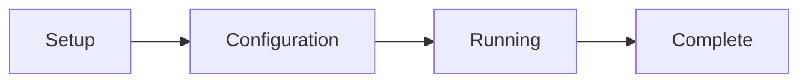

# GUI Usage Guide

## Starting the GUI

### Method 1: Direct Command

```bash
# Activate FOCUS environment
conda activate FOCUS

# Start GUI
focus
```

### Method 2: Container Deployment

```bash
# Start GUI in container
bash focus-container.sh --mount /path/to/your/data
```

### Method 3: Windows

```batch
conda activate FOCUS
focus
```

## GUI Interface Overview

The FOCUS GUI consists of four main stages:



### Stage 1: Setup

**Purpose**: Define your dataset location and configuration approach

**Interface Elements:**
- **Dataset Path**: Browse to your dataset directory
- **Load Config**: Load an existing configuration file
- **New Config**: Start a new configuration from scratch
- **Next**: Proceed to configuration stage

**Actions:**
1. Click **Browse** to select your dataset directory
2. Choose **New Config** for first-time setup or **Load Config** to modify existing
3. Click **Next** to continue

### Stage 2: Configuration

**Purpose**: Define modalities, processing parameters, and pipeline settings

**Main Sections:**

#### Dataset Settings
- **Dataset Path**: Displayed from setup stage
- **Reference Modality**: Select which modality serves as the coordinate reference
- **Output Directory**: Where results will be saved (default: `<dataset_path>/merged`)

#### Modality Configuration

**Adding Modalities:**
1. Click **Add Modality** button
2. Select modality type from dropdown:
   - Microscopy Image
   - MSI (Mass Spectrometry Imaging)
   - Raman Spectroscopy
   - Spatial Transcriptomics
3. Enter modality name (must match directory names)
4. Configure modality-specific settings

**Modality-Specific Settings:**

**Microscopy Image:**
- **Input Format**: TIFF/CZI
- **Color Enhancement**: Enable/disable gamma correction and contrast stretching
- **Background Removal**: Enable/disable and set threshold
- **Crop to Tissue**: Enable/disable with margin size
- **Resolution Level**: Pyramid level for processing

**MSI (Mass Spectrometry Imaging):**
- **Ion Mode**: Positive/Negative/Both
- **Mass Range**: m/z range to process
- **Intensity Normalization**: TIC/Max/None
- **Background Detection**: Enable/disable GMM-based detection
- **Recalibration**: Enable/disable m/z recalibration
- **Lipid Annotation**: Enable/disable lipid database matching

**Raman Spectroscopy:**
- **Wavenumber Range**: Range to process
- **BaSiC Correction**: Enable/disable
- **Background Removal**: Enable/disable
- **ASHLAR Stitching**: Enable/disable
- **Spectral Cleaning**: Despike, denoise, baseline options

**Spatial Transcriptomics:**
- **Quality Control**: Mitochondrial gene threshold
- **Filtering**: Min/max genes per spot
- **Normalization**: Total counts, log1p
- **Highly Variable Genes**: Number to select

#### Processing Options

**Preprocessing:**
- **Force Recomputing**: Reprocess all files even if cached
- **Parallel Processing**: Number of CPU cores to use

**Alignment:**
- **Perform Alignment**: Enable/disable alignment stage
- **Alignment Strategy**: Manual (GUI) or Pre-aligned
- **Force Recomputing**: Re-run alignment even if cached

**Registration:**
- **Perform Registration**: Enable/disable registration stage
- **Registration Type**: Feature Extraction (GPU) or Spot Interpolation (CPU)
- **Force Recomputing**: Re-run registration even if cached

**Feature Extraction Settings (GPU only):**
- **Patch Size**: Size of image patches (default: 224)
- **Background Color**: White or black background handling
- **Min/Max Rescale**: Normalize patch intensities

**Spot Interpolation Settings:**
- **K Neighbors**: Number of nearest neighbors
- **Max Distance**: Maximum interpolation distance
- **Weighting**: Distance weighting function

#### Advanced Settings

- **Logging Level**: Debug/Info/Warning/Error
- **Temp Directory**: Location for temporary files
- **Cache Directory**: Location for cached intermediate results
- **HuggingFace Token**: Required for feature extraction registration

**Actions:**
1. Configure all desired modalities
2. Set processing options
3. Review advanced settings
4. Click **Save Config** to save configuration file
5. Click **Start Pipeline** to begin processing

### Stage 3: Running

**Purpose**: Monitor pipeline execution and perform interactive tasks

**Interface Elements:**
- **Progress Bar**: Overall pipeline progress
- **Stage Indicator**: Current pipeline stage (Preprocessing/Alignment/Registration/Compilation)
- **Log Panel**: Real-time logging output
- **Status Panel**: Current operation details
- **Alignment Button**: Appears during alignment stage

**Pipeline Stages:**

#### Preprocessing Stage
- Shows progress for each modality
- Displays sample-by-sample processing
- Estimated time remaining
- Log output for each operation

#### Alignment Stage
1. **Manual Alignment Required**: When alignment button appears
2. Click **Open Alignment Tool** to launch alignment GUI
3. Perform manual landmark alignment (see [Alignment Guide](../pipeline/alignment.md))
4. Close alignment tool when complete
5. Pipeline continues automatically

#### Registration Stage
- Shows feature extraction or interpolation progress
- Displays modality-by-modality processing
- GPU utilization monitor (if applicable)
- Memory usage monitoring

#### Compilation Stage
- MuData compilation progress
- Validation checks
- Final output generation

**Actions:**
- Monitor progress in real-time
- Review logs for any warnings/errors
- Perform manual alignment when prompted
- Pipeline runs automatically through all stages

### Stage 4: Complete

**Purpose**: Review results and access output files

**Interface Elements:**
- **Completion Summary**: Pipeline execution summary
- **Output Files List**: All generated files with paths
- **Statistics**: Processing time, data sizes
- **Open Folder**: Button to open output directory
- **New Pipeline**: Button to start new pipeline
- **Exit**: Button to close GUI

**Output Files:**
- Preprocessed files for each modality
- Aligned coordinate files
- Registered feature matrices
- Final MuData file
- Log files
- Configuration file (saved copy)

**Actions:**
1. Review output file list
2. Click **Open Folder** to access results
3. Click **New Pipeline** to start another run
4. Click **Exit** to close the GUI

## Interactive Alignment Tool

### Overview

The alignment tool is a separate web interface for manual landmark-based registration between modalities.

### Starting the Tool

1. During the **Running** stage, when alignment is needed
2. Click **Open Alignment Tool** button
3. New browser window opens at `http://localhost:8000`

### Interface Layout

```
+---------------------------------------------------+
| Reference Modality | Target Modality             |
| +-----------------+ | +-----------------+        |
| |   Image/Spots   | | |   Image/Spots   |        |
| |                 | | |                 |        |
| |    (Fixed)      | | |    (Moving)     |        |
| +-----------------+ | +-----------------+        |
|                                                   |
| Controls:                                         |
| [Alignment Mode] [Zoom] [Pan] [Reset]            |
|                                                   |
| Status: Current sample (1/5)                      |
+---------------------------------------------------+
```

### Alignment Modes

#### Image-to-Image Alignment

1. **Reference Image**: Fixed image (target coordinate system)
2. **Target Image**: Moving image (to be aligned)
3. **Controls**:
   - Click and drag corners of target image to match reference
   - Use zoom/pan for precise alignment
   - Reset to original position
4. **Confirmation**: Click **Confirm Alignment** when satisfied

#### Image-to-Spot Alignment

1. **Reference Image**: Fixed image
2. **Target Spots**: Moving spots displayed as colored points
3. **Controls**:
   - Drag individual spots to correct positions
   - Select multiple spots for group movement
   - Use grid overlay for guidance
4. **Spot Size**: Adjust spot size to match image scale
5. **Confirmation**: Click **Confirm Alignment** when satisfied

#### Spot-to-Spot Alignment

1. **Reference Spots**: Fixed spots (target coordinate system)
2. **Target Spots**: Moving spots (to be aligned)
3. **Controls**:
   - Drag target spots to match reference spots
   - Use distance metrics for guidance
   - Toggle spot classes/colors
4. **Confirmation**: Click **Confirm Alignment** when satisfied

### Navigation Controls

- **Zoom**: Mouse wheel or +/- buttons
- **Pan**: Click and drag background
- **Reset View**: Double-click or reset button
- **Toggle Overlay**: Show/hide reference or target
- **Opacity**: Adjust overlay transparency
- **Measurement**: Distance measurement tool

### Workflow

1. **Sample Selection**: Tool automatically loads current sample
2. **Alignment**: Perform manual alignment as described above
3. **Confirmation**: Click **Confirm Alignment** to save
4. **Next Sample**: Tool automatically advances to next sample
5. **Completion**: Close tool when all samples processed

### Tips for Accurate Alignment

1. **Use Landmarks**: Identify distinctive features present in both modalities
2. **Multiple Points**: Use at least 4-6 well-distributed landmarks
3. **Zoom In**: Use high zoom for precise landmark placement
4. **Check Coverage**: Ensure entire tissue area is covered
5. **Symmetry**: Use symmetrical features for verification
6. **Iterative**: Make small adjustments and verify frequently

## Configuration Management

### Saving Configurations

1. In **Configuration** stage, click **Save Config**
2. Configuration saved as `focus_config.json` in dataset directory
3. File includes all settings and parameters

### Loading Configurations

1. In **Setup** stage, click **Load Config**
2. Browse to existing `focus_config.json` file
3. All settings loaded and ready for execution

### Modifying Configurations

1. Load existing configuration
2. Make desired changes in **Configuration** stage
3. Click **Save Config** to overwrite or **Save As** for new file

### Configuration File Structure

The JSON configuration file contains:

```json
{
  "dataset_path": "/path/to/dataset",
  "reference_modality": "microscopy",
  "perform_alignment": true,
  "perform_registration": true,
  "huggingface_token": "your_token_here",
  "modalities": [
    {
      "name": "microscopy",
      "type": "microscopy_image",
      "processing_settings": {
        "color_enhancement": true,
        "background_removal": true,
        "crop_to_tissue": true,
        "resolution_level": 0
      },
      "alignment_strategy": "manual",
      "registration_type": "none"
    },
    {
      "name": "msi",
      "type": "msi",
      "processing_settings": {
        "ion_mode": "positive",
        "mass_range": [100, 1000],
        "normalization": "tic",
        "background_detection": true
      },
      "alignment_strategy": "manual",
      "registration_type": "spot_interpolation",
      "registration_settings": {
        "k_neighbors": 5,
        "max_distance": 100,
        "weighting": "distance"
      }
    }
  ]
}
```

See [Configuration Reference](../configuration/config_fields.md) for detailed field explanations.

## GUI Settings and Preferences

### Display Settings

- **Theme**: Light/Dark mode toggle
- **Font Size**: Adjust interface text size
- **Language**: English (default)
- **Animations**: Enable/disable interface animations

### Performance Settings

- **CPU Cores**: Limit CPU usage
- **Memory Limit**: Set maximum memory usage
- **Cache Size**: Control disk cache size
- **GPU Selection**: Choose specific GPU (multi-GPU systems)

### Advanced Settings

- **Logging Level**: Debug/Info/Warning/Error
- **Temp Directory**: Custom temporary file location
- **Proxy Settings**: Configure network proxy
- **Timeout Settings**: Adjust network timeouts

## Troubleshooting GUI Issues

### Common Problems

**Issue: GUI doesn't start**
- **Solution**: Check conda environment is activated
- **Command**: `conda activate FOCUS`

**Issue: Port already in use**
- **Solution**: Change GUI port or kill existing process
- **Command**: `lsof -i :5050` then `kill <PID>`

**Issue: Browser doesn't open automatically**
- **Solution**: Manually open `http://localhost:5050`

**Issue: Alignment tool doesn't launch**
- **Solution**: Check port 8000 availability
- **Command**: `lsof -i :8000` then `kill <PID>`

### Logs and Debugging

- **GUI Logs**: Located in `~/.focus/gui_logs/`
- **Pipeline Logs**: In dataset directory under `logs/`
- **Browser Console**: Press F12 in browser for frontend errors
- **Network Tab**: Check API requests/responses

### Error Messages

| Error | Meaning | Solution |
|-------|---------|----------|
| "Dataset path not found" | Invalid dataset directory | Check path exists and permissions |
| "Configuration invalid" | Malformed JSON config | Validate JSON structure |
| "Modality not found" | Directory missing | Check directory names match config |
| "Port in use" | Another process using port | Kill process or change port |
| "GPU not available" | CUDA not detected | Install drivers or use CPU mode |

## Best Practices

### Data Organization

1. **Consistent Naming**: Use clear, consistent sample and modality names
2. **Directory Structure**: Follow exact structure requirements
3. **File Formats**: Use supported input formats only
4. **Permissions**: Ensure read/write access to all directories

### Configuration

1. **Start Simple**: Begin with default settings
2. **Test Small**: Test with small subset first
3. **Incremental Changes**: Modify one setting at a time
4. **Save Frequently**: Save configuration often

### Execution

1. **Monitor Resources**: Watch CPU/RAM usage
2. **Check Logs**: Review logs during execution
3. **Validate Outputs**: Verify intermediate files
4. **Backup Config**: Keep backup of working configurations

### Alignment

1. **Use High-Quality Reference**: Choose modality with clear landmarks
2. **Multiple Landmarks**: Use 6+ well-distributed points
3. **Zoom for Precision**: Use maximum zoom for critical areas
4. **Verify Coverage**: Ensure entire tissue is aligned

## Keyboard Shortcuts

| Shortcut | Action |
|----------|--------|
| `Ctrl+S` | Save configuration |
| `Ctrl+O` | Load configuration |
| `Ctrl+N` | New configuration |
| `Ctrl+R` | Start pipeline |
| `Ctrl+Q` | Quit GUI |
| `Ctrl+F` | Search in logs |
| `Ctrl++` | Zoom in |
| `Ctrl+-` | Zoom out |
| `Ctrl+0` | Reset zoom |

## Browser Compatibility

| Browser | Supported | Notes |
|---------|-----------|-------|
| Chrome | ✅ | Recommended |
| Firefox | ✅ | Full support |
| Safari | ✅ | macOS only |
| Edge | ✅ | Chromium-based |
| Opera | ✅ | Chromium-based |
| Internet Explorer | ❌ | Not supported |

## Mobile/Tablet Access

- **Not officially supported** but may work on tablets
- **Minimum screen size**: 1024x768 pixels
- **Touch support**: Basic functionality available
- **Recommended**: Use desktop/laptop for full functionality

## Accessibility Features

- **Keyboard Navigation**: Full keyboard support
- **Screen Reader**: ARIA labels for all elements
- **High Contrast**: Available in display settings
- **Font Scaling**: Adjustable text size
- **Color Blind**: Alternative color schemes available

## Next Steps

Now that you're familiar with the GUI:

1. **Try the CLI**: Explore [CLI Usage](cli_usage.md) for automated execution
2. **Learn Configuration**: Deep dive into [Configuration Reference](../configuration/config_fields.md)
3. **Understand Pipeline**: Read about [Pipeline Stages](../pipeline/preprocessing.md)
4. **Run Examples**: Try with sample datasets

## Support

For GUI-related issues:

1. **Check Browser Console**: Press F12 for error details
2. **Review Logs**: Check GUI and pipeline logs
3. **Clear Cache**: Clear browser cache if issues persist
4. **Try Different Browser**: Switch to Chrome/Firefox
5. **Report Issues**: Provide detailed error information when reporting bugs