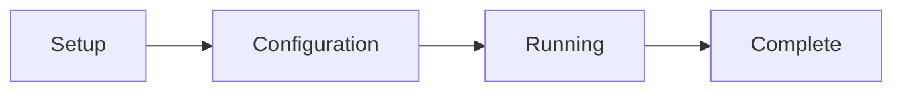

# GUI Usage Guide

## Starting the GUI

### Method 1: Direct Command

```bash
# Activate FOCUS environment
conda activate FOCUS

# Start GUI
focus
```

### Method 2: Container Deployment

```bash
# Start GUI in container
bash focus-container.sh --mount /path/to/your/data
```

### Method 3: Windows

```batch
conda activate FOCUS
focus
```

## GUI Interface Overview

The FOCUS GUI consists of four main stages:



### Stage 1: Setup

**Purpose**: Define your dataset location and configuration approach

**Interface Elements:**
- **Dataset Path**: Browse to your dataset directory
- **Load Config**: Load an existing configuration file
- **New Config**: Start a new configuration from scratch
- **Next**: Proceed to configuration stage

**Actions:**
1. Click **Browse** to select your dataset directory
2. Choose **New Config** for first-time setup or **Load Config** to modify existing
3. Click **Next** to continue

### Stage 2: Configuration

**Purpose**: Define modalities, processing parameters, and pipeline settings

**Main Sections:**

#### Dataset Settings
- **Dataset Path**: Displayed from setup stage
- **Reference Modality**: Select which modality serves as the coordinate reference

Outputs are always written back under `dataset_path` (the final dataset lands at
`<dataset_path>/merged/multimodal_dataset.h5mu`); there is no separate output-directory
field.

#### Modality Configuration

**Adding Modalities:**
1. Click **Add Modality** button
2. Select modality type from dropdown:
   - Microscopy Image
   - MSI (Mass Spectrometry Imaging)
   - Raman Spectroscopy Imaging
   - Spatial Transcriptomics
3. Enter modality name (must match directory names)
4. Configure modality-specific settings

**Modality-Specific Settings:**

**Microscopy Image:**
- **Input Format**: TIFF/CZI
- **Color Enhancement**: Enable/disable gamma correction and contrast stretching
- **Background Removal**: Enable/disable and set threshold
- **Crop to Tissue**: Enable/disable with margin size

!!! note
    The number of OME-TIFF pyramid levels is computed automatically from the image size and is not a GUI setting.

**MSI (Mass Spectrometry Imaging):**
- **Ion Mode**: Positive/Negative/Both
- **Mass Range**: m/z range to process
- **Intensity Normalization**: None/TIC/Log/CLR
- **Background Detection**: Enable/disable GMM-based detection
- **Recalibration**: Enable/disable m/z recalibration
- **Lipid Annotation**: Enable/disable lipid database matching

**Raman Spectroscopy Imaging:**
- **Wavenumber Range**: Range to process
- **BaSiC Correction**: Enable/disable
- **Background Removal**: Enable/disable
- **ASHLAR Stitching**: Enable/disable
- **Spectral Cleaning**: Despike, denoise, baseline options

**Spatial Transcriptomics:**
- **Quality Control**: Mitochondrial gene threshold
- **Filtering**: Min/max genes per spot
- **Normalization**: Total counts, log1p
- **Highly Variable Genes**: Number to select

#### Processing Options

**Preprocessing:**
- **Force Recomputing**: Reprocess all files even if cached

**Alignment:**
- **Perform Alignment**: Enable/disable alignment stage
- **Alignment Strategy**: Manual (GUI) or Pre-aligned
- **Force Recomputing**: Re-run alignment even if cached

**Registration:**
- **Perform Registration**: Enable/disable registration stage
- **Registration Type**: Feature Extraction (GPU) or Spot Interpolation (CPU)
- **Force Recomputing**: Re-run registration even if cached

**Feature Extraction Settings (GPU only):**
- **Patch Size**: Size of image patches (default: 224)
- **Background Color**: White or black background handling

Spot-interpolation registration is parameter-free in the GUI — the interpolation
neighbourhood is derived automatically from each modality's spot size.

#### Advanced Settings

- **HuggingFace Token**: Required for `feature_extraction` registration (used to
  download the Prov-GigaPath model weights)

**Actions:**
1. Configure all desired modalities
2. Set processing options
3. Review advanced settings
4. Configuration is automatically saved as `focus_config.json`
5. Click **Start Processing** to run FOCUS with the current configuration

### Stage 3: Running

**Purpose**: Monitor pipeline execution and perform interactive tasks

**Interface Elements:**
- **Progress Bar**: Overall pipeline progress
- **Stage Indicator**: Current pipeline stage (Preprocessing/Alignment/Registration/Compilation)
- **Log Panel**: Real-time logging output
- **Status Panel**: Current operation details
- **Alignment Button**: Appears during alignment stage

**Pipeline Stages:**

#### Preprocessing Stage
- Shows progress for each modality
- Displays sample-by-sample processing
- Estimated time remaining
- Log output for each operation

#### Alignment Stage
1. **Manual Alignment Required**: When alignment button appears
2. Click **Open Alignment Tool** to launch alignment GUI
3. Perform visual alignment (see [Alignment Guide](../pipeline/alignment.md))
4. Close alignment tool when complete
5. Pipeline continues automatically

#### Registration Stage
- Shows feature extraction or interpolation progress
- Displays modality-by-modality processing
- GPU utilization monitor (if applicable)
- Memory usage monitoring

#### Compilation Stage
- MuData compilation progress
- Validation checks
- Final output generation

**Actions:**
- Monitor progress in real-time
- Review logs for any warnings/errors
- Perform manual alignment when prompted
- Pipeline runs automatically through all stages

### Stage 4: Complete

**Purpose**: Review results and access output files

**Interface Elements:**
- **Completion Summary**: Pipeline execution summary
- **Output Files List**: All generated files with paths
- **Statistics**: Processing time, data sizes
- **Open Folder**: Button to open output directory
- **New Pipeline**: Button to start new pipeline
- **Exit**: Button to close GUI

**Output Files:**
- Preprocessed files for each modality
- Aligned coordinate files
- Registered feature matrices
- Final MuData file (`<dataset_path>/merged/multimodal_dataset.h5mu`)
- The run log file (`<dataset_path>/focus.log`)
- Configuration file (`<dataset_path>/focus_config.json`)

**Actions:**
1. Review output file list
2. Click **Open Folder** to access results
3. Click **New Pipeline** to start another run
4. Click **Exit** to close the GUI

## Interactive Alignment Tool

### Overview

The alignment tool is a separate web interface for interactive visual alignment between modalities.

### Starting the Tool

1. During the **Running** stage, when alignment is needed
2. Click **Open Alignment Tool** button
3. New browser window opens at `http://localhost:8000`

### Interface Layout

The alignment tool is divided into three main sections:

**Left Panel: Modality Display**
- Shows both reference and target modalities side by side
- Reference modality is overlaid on top of the target modality
- Reference modality can be moved; target modality is fixed

**Center Controls: Camera vs. Alignment Mode**
- **Camera Control**: Move the point of view (pan and zoom)
- **Alignment Control**: Move the reference modality using transformation tools:
  - **Translation**: Click and drag to move the reference modality across the x-y plane
  - **Rotation**: Rotate the reference modality around its centroid
  - **Scaling**: Scroll with mouse wheel to scale the reference modality up or down

**Right Panel: Control Tools**
- Show/hide specific spot clusters (for spot-based modalities)
- Fine-tune transformation parameters
- Reset all transformations to return to original state
- **Confirm Alignment**: Click when satisfied with the overlay position

### Alignment Modes

The alignment tool automatically adapts to your modality types. In all modes, **transformations are applied only to the reference modality**. The target modality remains fixed. FOCUS will then use the computed reference-to-target alignment transform to locate reference spots/pixels in the target modality's coordinate space during the registration step.

#### Image-to-Image Alignment

Aligning a reference image modality to a target image modality.

1. **Left panel**: Reference image (can be moved)
2. **Right panel**: Target image (fixed, defines the coordinate space)
3. **Controls**:
   - Click and drag to translate the reference image
   - Use rotation control to rotate reference around its center
   - Scroll to scale the reference image up or down
   - Use zoom/pan camera controls to inspect details
   - Reset button returns reference to original position
4. **Confirmation**: Click **Confirm Alignment** when the overlays match

#### Spot-to-Image Alignment

Aligning a reference spot-based modality to a target image modality.

1. **Left panel**: Reference spots (can be moved as a group)
2. **Right panel**: Target image (fixed, defines the coordinate space)
3. **Controls**:
   - Click and drag to translate reference spots across the target image
   - Use rotation control to rotate reference spots around their centroid
   - Scroll to scale the reference spots relative to the target
   - Show/hide individual spot clusters in the right panel to verify alignment
   - Use zoom/pan camera controls for precise positioning
   - Reset button returns reference to original position
4. **Confirmation**: Click **Confirm Alignment** when spots are correctly positioned

#### Spot-to-Spot Alignment

Aligning a reference spot-based modality to a target spot-based modality.

1. **Left panel**: Reference spots (can be moved)
2. **Right panel**: Target spots (fixed, define the coordinate space)
3. **Controls**:
   - Click and drag to translate reference spots to match target spots
   - Use rotation control to align reference spot patterns with target pattern
   - Scroll to scale reference spots if spatial resolution differs
   - Show/hide specific spot clusters to verify correspondence
   - Use zoom/pan camera controls for detailed inspection
   - Reset button returns reference to original position
4. **Confirmation**: Click **Confirm Alignment** when reference spots overlay target spots correctly

### Control Panel Tools

The right control panel contains tools to fine-tune your alignment:

**Transformation Controls**
- **Translation**: Click and drag the reference modality to move it across the x-y plane
- **Rotation**: Rotate the reference modality around its centroid
- **Scale**: Scroll with the mouse wheel to scale the reference modality relative to the target

**Camera Controls** (for precise viewing)
- **Pan**: Click and drag the background to move your view
- **Zoom**: Scroll to zoom in/out, or use camera control mode for finer control
- **Reset View**: Return to the default zoom level and pan position

**Cluster/Feature Controls** (for spot-based modalities)
- **Show/Hide Clusters**: Toggle visibility of specific spot clusters to verify alignment
- **Toggle Spot Classes**: Show/hide different classes or colors of spots

**Reset and Confirm**
- **Reset Alignment**: Returns the reference modality to its original position (undo all transformations)
- **Confirm Alignment**: Saves the alignment transform and advances to the next sample/modality

### Workflow

1. **Sample Selection**: Tool automatically loads current sample
2. **Alignment**: Perform manual alignment as described above
3. **Confirmation**: Click **Confirm Alignment** to save
4. **Next Sample**: Tool automatically advances to next sample
5. **Completion**: Close tool when all samples processed

### Tips for Accurate Alignment

1. **Visual Reference**: Identify distinctive features present in both modalities
2. **Distributed Adjustments**: Make adjustments distributed across the tissue area
3. **Zoom In**: Use high zoom for precise alignment
4. **Check Coverage**: Ensure entire tissue area is covered
5. **Symmetry**: Use symmetrical features for verification
6. **Iterative**: Make small adjustments and verify frequently

## Configuration Management

### Automatic Configuration Saving

The configuration is automatically saved as `focus_config.json` in the dataset directory every time you make a change. You do not need to click a save button—changes are saved immediately.

### Loading Configurations

1. In **Setup** stage, click **Load Config**
2. Browse to existing `focus_config.json` file or another named config file
3. All settings loaded and ready for execution

### Modifying Configurations

1. Load existing configuration in the GUI
2. Make desired changes in **Configuration** stage
3. Changes are automatically saved to `focus_config.json`
4. To keep multiple configs, manually copy `focus_config.json` to different filenames (e.g., `focus_config_v1.json`, `focus_config_v2.json`) and load them as needed

### Configuration File Structure

The JSON configuration file contains:

```json
{
  "dataset_path": "/path/to/dataset",
  "reference_modality": "msi",
  "perform_alignment": true,
  "perform_registration": true,
  "huggingface_token": null,
  "spatial_annotations": null,
  "modalities": [
    {
      "alignment_strategy": "manual",
      "name": "msi",
      "processing_settings": {
        "mass_tolerance": 10,
        "intensity_normalization": "tic",
        "min_intensity_threshold": 10000,
        "detect_background": true,
        "force_recomputing": false
      },
      "registration_settings": {},
      "registration_type": "none",
      "type": "msi"
    },
    {
      "alignment_strategy": "manual",
      "alignment_force_recomputing": false,
      "name": "microscopy",
      "processing_settings": {
        "color_enhancement": true,
        "remove_background": true,
        "crop_to_tissue": true,
        "gamma": 0.45,
        "force_recomputing": false
      },
      "registration_settings": {},
      "registration_type": "feature_extraction",
      "type": "microscopy_image"
    }
  ]
}
```

See [Configuration Reference](../configuration/config_fields.md) for detailed field explanations.

## Troubleshooting GUI Issues

### Common Problems

**Issue: GUI doesn't start**
- **Solution**: Check conda environment is activated
- **Command**: `conda activate FOCUS`

**Issue: Port already in use**
- **Solution**: Change GUI port or kill existing process
- **Command**: `lsof -i :5050` then `kill <PID>`

**Issue: Browser doesn't open automatically**
- **Solution**: Manually open `http://localhost:5050`

**Issue: Alignment tool doesn't launch**
- **Solution**: Check port 8000 availability
- **Command**: `lsof -i :8000` then `kill <PID>`

### Logs and Debugging

- **Run log**: A single log file is written to `<dataset_path>/focus.log` (always at
  DEBUG level). Start the GUI with `focus --debug` to also show DEBUG output, including
  werkzeug HTTP request logs, in the terminal.
- **Browser Console**: Press F12 in the browser for frontend errors
- **Network Tab**: Check API requests/responses

### Error Messages

| Error | Meaning | Solution |
|-------|---------|----------|
| "Dataset path not found" | Invalid dataset directory | Check path exists and permissions |
| "Configuration invalid" | Malformed JSON config | Validate JSON structure |
| "Modality not found" | Directory missing | Check directory names match config |
| "Port in use" | Another process using port | Kill process or change port |
| "GPU not available" | CUDA not detected | Install drivers or use CPU mode |

## Best Practices

### Data Organization

1. **Consistent Naming**: Use clear, consistent sample and modality names
2. **Directory Structure**: Follow exact structure requirements
3. **File Formats**: Use supported input formats only
4. **Permissions**: Ensure read/write access to all directories

### Configuration

1. **Start Simple**: Begin with default settings
2. **Test Small**: Test with small subset first
3. **Incremental Changes**: Modify one setting at a time
4. **Auto-saved**: Configuration is automatically saved as you make changes

### Execution

1. **Monitor Resources**: Watch CPU/RAM usage
2. **Check Logs**: Review logs during execution
3. **Validate Outputs**: Verify intermediate files
4. **Backup Config**: Keep backup of working configurations

### Alignment

1. **Use High-Quality Reference**: Choose modality with rich morphological features
2. **Distributed Adjustments**: Make adjustments across the tissue area
3. **Zoom for Precision**: Use maximum zoom for critical areas
4. **Verify Coverage**: Ensure entire tissue is aligned

## Next Steps

Now that you're familiar with the GUI:

1. **Try the CLI**: Explore [CLI Usage](cli_usage.md) for automated execution
2. **Learn Configuration**: Deep dive into [Configuration Reference](../configuration/config_fields.md)
3. **Understand Pipeline**: Read about [Pipeline Stages](../pipeline/preprocessing.md)
4. **Prepare your data**: See [Preparing Your Data](../user_guide/data_preparation.md)

## Support

For GUI-related issues:

1. **Check Browser Console**: Press F12 for error details
2. **Review Logs**: Check GUI and pipeline logs
3. **Clear Cache**: Clear browser cache if issues persist
4. **Try Different Browser**: Switch to Chrome/Firefox
5. **Report Issues**: Provide detailed error information when reporting bugs